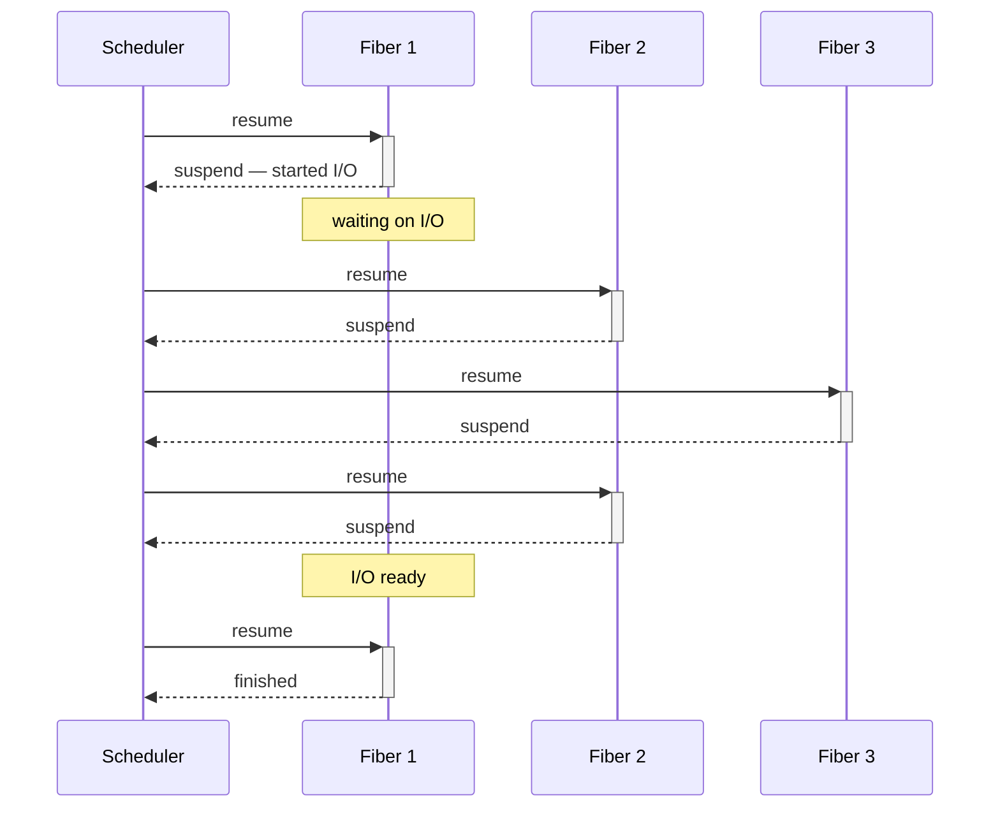
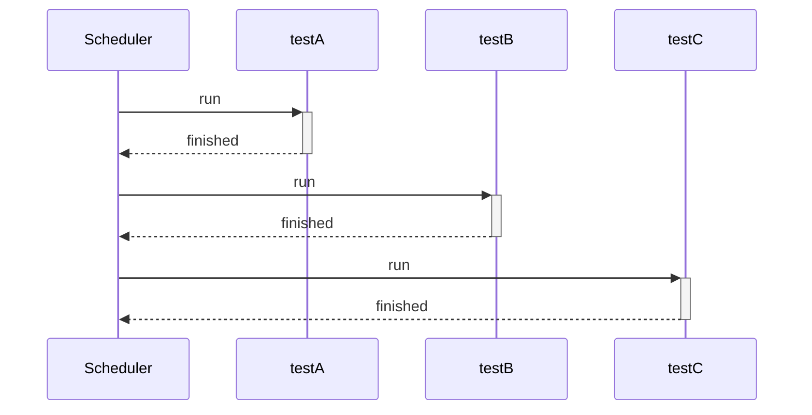
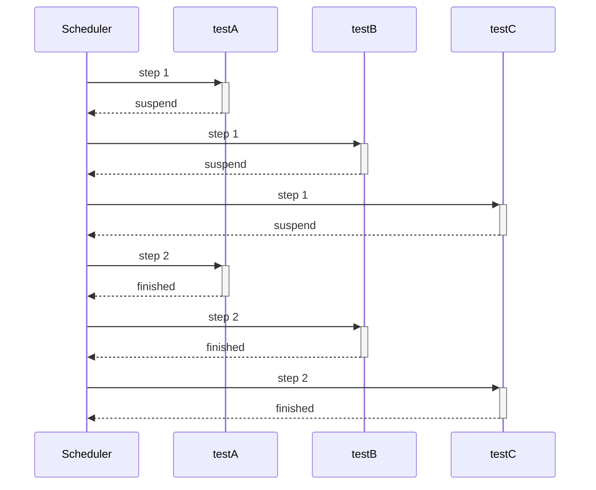

# Fiber — fibers and cooperative concurrency

A fiber is a function whose execution you can pause and later resume from the same spot, with its whole call stack intact. Unlike threads, fibers are cooperative: they don't run in parallel and never preempt one another. The code itself decides where to yield control, by calling `\Fiber::suspend()`. Fibers arrived in PHP 8.1; see the [PHP manual](https://www.php.net/manual/en/language.fibers.php) for details.

A fiber on its own can only suspend itself, and it can't decide who to resume after `\Fiber::suspend()` or in what order. That's the job of a **scheduler**: code on top of the fibers that keeps a list of them, hands control from one to the next, and drives them all to completion. In async frameworks this role usually falls to an event loop that waits on I/O readiness. Testo uses its own cooperative scheduler, tailored for tests.




The Fiber plugin runs your tests inside ordinary PHP fibers, driven by Testo's own cooperative scheduler, with no event loop and no preemption. It does three things:
1. Runs a test in **its own fiber** so `\Fiber::suspend()` works inside it, for when the test drives fibers or cooperative code of its own.
2. **Interleaves** the tests of a single Test Case to catch races (bugs that depend on execution order).
3. Runs **coroutines within a single test**, when a scenario needs several participants at once: a producer and a consumer, a client and a server.

<plugin-info name="Fiber" />

<signature h="2" name="#[\Testo\Fiber\RunInFiber(Schedule $schedule = Schedule::Solo)]">
<short>Runs a test (on a method) or a whole case (on a class) in fibers, under Testo's cooperative scheduler.</short>
<description>

The attribute can go on a **method** or on a **class** (Test Case):

- on a **method** — only that test runs in its own fiber; the <enum>\Testo\Fiber\Schedule</enum> parameter is meaningless for a single test and is ignored;
- on a **class** — every test in the case is scheduled per the chosen <enum>\Testo\Fiber\Schedule</enum>: <enum>\Testo\Fiber\Schedule::Solo</enum> (each test in its own fiber, one after another — the default) or cooperative interleaving via <enum>\Testo\Fiber\Schedule::RoundRobin</enum> / <enum>\Testo\Fiber\Schedule::Random</enum>.

The two levels don't conflict: if the attribute is already on the class, the one on a method doesn't create a second fiber, since the test is already scheduled by the case.

Switching is **cooperative**: the scheduler hands control to another fiber only where the current one calls `\Fiber::suspend()`. There's no event loop and no preemption, so a test that never suspends never yields to anyone.

Regardless of level, each test gets its **own coroutine scope**: <func>\Testo\Fiber\Coroutine::spawn()</func> adds coroutines to its schedule. See [Coroutines inside a test](#coroutines-inside-a-test) for more.

</description>
<param name="$schedule">How to schedule the case's tests (class-level only). Has no effect on coroutines inside a test: those always interleave round-robin.</param>
<example>

Here the test exercises cooperative code that calls `\Fiber::suspend()` itself. Such code has to run inside a fiber, which is exactly what <attr>\Testo\Fiber\RunInFiber</attr> sets up:

::: code-group
```php [Test]
use Testo\Assert;
use Testo\Fiber\RunInFiber;
use Testo\Test;

#[Test]
#[RunInFiber]
public function runsCooperativeDriver(): void
{
    $job = new StepwiseJob();

    // StepwiseJob calls \Fiber::suspend() internally
    $job->run();

    Assert::same($job->completed, ['fetch', 'process', 'store']);
}
```

```php [Driver]
// The cooperative code under test: between steps it yields
// control to the scheduler via \Fiber::suspend().
final class StepwiseJob
{
    /** @var list<string> */
    public array $completed = [];

    public function run(): void
    {
        foreach (['fetch', 'process', 'store'] as $step) {
            $this->completed[] = $step;
            \Fiber::suspend();     // cooperative switch point
        }
    }
}
```
:::

</example>
</signature>

::: warning
Without <attr>\Testo\Fiber\RunInFiber</attr> the test body runs outside any fiber, in the main execution context (`{main}`), where `\Fiber::getCurrent()` returns `null`. There's nothing to suspend there: `\Fiber::suspend()` throws a `\FiberError` with the message "Cannot suspend outside of a fiber", and the test fails.
:::

## Interleaving a case's tests

<attr>\Testo\Fiber\RunInFiber</attr> on a class with <enum>\Testo\Fiber\Schedule::RoundRobin</enum> or <enum>\Testo\Fiber\Schedule::Random</enum> runs all of the case's tests together, switching between them at `\Fiber::suspend()` points. This is how you catch races: while one test is suspended part-way through its work, another gets to inspect the shared state and catch it in an intermediate, not-yet-consistent form.

With <enum>\Testo\Fiber\Schedule::Solo</enum> the tests run one after another: each finishes before the next starts:



With <enum>\Testo\Fiber\Schedule::RoundRobin</enum> the same tests run interleaved, one step per round. The total time is the same (there's no parallelism), but each test now sees its neighbors at intermediate stages:



::: question Do datasets, Retry and Repeat interleave within a test too?
No. Only tests interleave with each other. Datasets, along with attempts under <attr>\Testo\Retry</attr> and <attr>\Testo\Repeat</attr>, run sequentially within a single test. See [One fiber per test](#one-fiber-per-test) for why.
:::

<signature h="3" name="enum \Testo\Fiber\Schedule">
<short>How a Test Case's tests are scheduled under <attr>\Testo\Fiber\RunInFiber</attr>.</short>
<description>

Class-level only. A test stays ready until it finishes; each step runs it up to its next suspension.

</description>
<case name="Solo">**Default.** Tests run one at a time, sequentially.</case>
<case name="RoundRobin">One step per test per round, in order. Deterministic interleaving.</case>
<case name="Random">A random test on each step. Good for smoking out order-dependent bugs. Without a seed, runs aren't reproducible.</case>
</signature>

::: question If every test runs at once, what does the terminal show?
The output of interleaved tests isn't jumbled: the terminal shows each test as one continuous block (its node, datasets, `-vv` streaming, result line). The blocks appear in the order the tests finish.
:::

## Coroutines inside a test

Interleaving covers "several tests at once". But you often need several participants **within a single** test: a producer and a consumer over a shared queue, a client and a server, a worker and whoever stops it. You can drive them by hand with `new \Fiber`, but then the test turns into a scheduler itself: you have to decide who to resume and when, and gather results and errors by hand.

That's why every <attr>\Testo\Fiber\RunInFiber</attr> test gets its **own scheduler**. The test body is its first coroutine; <func>\Testo\Fiber\Coroutine::spawn()</func> adds the rest to the same schedule. They interleave with the test body and with each other at `\Fiber::suspend()` points, and under a class-level <attr>\Testo\Fiber\RunInFiber</attr> the whole scope keeps interleaving with the other tests of the case as well.

```php
use Testo\Assert;
use Testo\Fiber\Coroutine;
use Testo\Fiber\RunInFiber;
use Testo\Test;

#[Test]
#[RunInFiber]
public function awaitsCoroutineResult(): void
{
    // A background coroutine runs interleaved with the test body
    $worker = Coroutine::spawn(static function (): int {
        // ... computes something, yielding control along the way via \Fiber::suspend() ...
        return 42;
    });

    // ... meanwhile the test body does its own thing ...

    // Await the coroutine and grab its result
    Assert::same($worker->await(), 42);
}
```

<signature h="3" name="\Testo\Fiber\Coroutine::spawn(\Closure|\Fiber $body): Coroutine">
<short>Adds a coroutine to the current test's scope.</short>
<description>

The coroutine gets its first step in the current scheduling round, then runs cooperatively: it holds control until it suspends, awaits another coroutine, or finishes.

You can call it from anywhere inside the test, including from another coroutine: they all land in the same scope.

Throws a `\LogicException` if there's no scope (a test without <attr>\Testo\Fiber\RunInFiber</attr>), if the given `\Fiber` has already started, or if the scope is already closing — for example, when trying to spawn a coroutine from the `finally` of a coroutine being cancelled.

</description>
<param name="$body">A closure or an **unstarted** `\Fiber`. Whatever the body returns becomes the coroutine's result.</param>
<example>

```php
$worker = Coroutine::spawn(static fn(): string => $server->acceptOne());
```

</example>
</signature>

<signature h="3" name="\Testo\Fiber\Coroutine::await(): mixed">
<short>Awaits a coroutine and returns its result.</short>
<description>

Parks the calling coroutine until the awaited one finishes; the other coroutines (and the case's tests) keep running. If the coroutine has already finished, returns its result right away.

`await()` rethrows a coroutine's error wrapped in a <class>\Testo\Fiber\Exception\CompositeException</class> and marks it as handled, so its scope won't surface it again. If the coroutine was cancelled together with its scope, a <class>\Testo\Fiber\Exception\CancelledException</class> is thrown instead — a cancelled coroutine has no result.

</description>
<example>

```php
$ping = Coroutine::spawn(static fn(): string => $client->send('ping'));

Assert::same($ping->await(), 'pong');
Assert::true($ping->isFinished());
```

</example>
</signature>

<signature h="3" name="\Testo\Fiber\Coroutine::concurrently(\Closure|\Fiber ...$bodies): array">
<short>Runs the given functions at once and awaits them all.</short>
<description>

Sugar over <func>\Testo\Fiber\Coroutine::spawn()</func> + <func>\Testo\Fiber\Coroutine::await()</func>: it schedules everything into the current scope, parks the calling coroutine until the last one finishes, and returns the results under the same keys as the arguments — named arguments give string keys.

One coroutine failing doesn't abort the rest: they're driven to completion, then all the errors are collected into a single <class>\Testo\Fiber\Exception\CompositeException</class>, under the same keys as the results.

</description>
<param name="$bodies">Closures or unstarted fibers. Pass them as named arguments to get readable keys in the results and errors.</param>
<example>

```php
$results = Coroutine::concurrently(
    server: static fn(): string => $server->acceptOne(),
    client: static fn(): string => $client->send('ping'),
);

Assert::same($results['server'], 'ping');
```

</example>
</signature>

<signature h="3" name="\Testo\Fiber\Coroutine::isFinished(): bool">
<short>Whether the coroutine has finished — returned a result, failed, or was cancelled.</short>
</signature>

### How coroutines are scheduled

Inside a scope there's always a round-robin schedule: each unfinished coroutine — the test body included — takes one step per round. A step lasts until the next suspension point — <func>\Fiber::suspend()</func> or <func>\Testo\Fiber\Coroutine::await()</func> — or until the coroutine finishes. The strategy from <attr>\Testo\Fiber\RunInFiber</attr> governs only how **tests** interleave with each other; it doesn't extend to coroutines.

Between rounds the scope yields control outward. Because of that, one test's coroutines don't hog the case: under `#[RunInFiber(Schedule::RoundRobin)]` the neighboring tests keep getting their steps while those coroutines run.

### The scope closes with the test

Coroutines live strictly inside the test that spawned them: it isn't considered finished until all of them are. This is **structured concurrency**: a coroutine can't outlive its test.

- The body returns while coroutines are still running: the scheduler drives them to completion, and only then does the test close.
- The body **fails**: unfinished coroutines get a <class>\Testo\Fiber\Exception\CancelledException</class> thrown at their suspension point, so `finally` blocks run and resources are released.

Don't swallow the cancellation: a coroutine that catches <class>\Testo\Fiber\Exception\CancelledException</class> and suspends again will be resumed once more to run to the end, but it has no one left to cooperate with, since the scope is already closing.

::: warning A coroutine can't be forgotten
A coroutine you spawned but never awaited still runs to completion, and its failure fails the test. This is deliberate: an error silently swallowed in a background task is worse than a failed test.
:::

### Coroutine errors

Coroutine errors **always** arrive wrapped in a <class>\Testo\Fiber\Exception\CompositeException</class>, even when there's only one. That way your handling doesn't depend on whether one coroutine failed or three: the original exceptions sit in the `$errors` property, and the earliest one is also mirrored into <func>\Throwable::getPrevious()</func>, so the usual error output still shows the root cause.

```php
use Testo\Fiber\Exception\CompositeException;

try {
    Coroutine::concurrently(
        server: static fn() => throw new \RuntimeException('port taken'),
        client: static fn(): string => $client->send('ping'),
    );
} catch (CompositeException $e) {
    Assert::instanceOf($e->errors['server'], \RuntimeException::class);
}
```

If no one awaited a coroutine's error, it surfaces at the test level: an otherwise-passing test gets the `Error` status, caused by that same <class>\Testo\Fiber\Exception\CompositeException</class>. If the test body failed too, it keeps its own status, and its error goes first in the composite, as the root of the problem.

The test body's own exception is **not wrapped**: when the coroutines ran cleanly, it passes straight through, so <attr>\Testo\Assert\ExpectException</attr> on the body works as usual. Wrapping kicks in only when there's something from the coroutines to add.

### Circular awaits

Coroutines can lock up awaiting each other in a cycle: A awaits B's result, B awaits C's, and C awaits A. The cycle is closed, and no one can ever finish — a deadlock. The scheduler detects such a cycle and breaks it: a <class>\Testo\Fiber\Exception\DeadlockException</class> is thrown from the <func>\Testo\Fiber\Coroutine::await()</func> of the first doomed coroutine, with a stack trace pointing straight at the await that closed the cycle. The cycle is detected even when it runs through the scopes of **different** tests, which is possible when tests hand each other coroutine handles under a class-level <attr>\Testo\Fiber\RunInFiber</attr>.

This works only for <func>\Testo\Fiber\Coroutine::await()</func>: it's the one thing that parks a coroutine so the scheduler can tell what it's waiting for. A bare loop with `\Fiber::suspend()` waiting on an event that never comes looks like ordinary work to the scheduler, and such a test simply hangs.

## State isolation

Testo binds state (assertions, messages, container scopes, coverage, and so on) to the **running** test: on every fiber switch, one test's state is swapped out and the other's is swapped in. That's why `Assert::*` calls inside interleaved tests each land in their own history, not someone else's.

This extends to coroutines: assertions, messages, and covered lines from a coroutine are credited to the test that spawned it, at any nesting depth and under any strategy. The same goes for fibers a test creates and drives itself.

The guarantee holds while the test is running. A fiber that outlives its test and gets resumed by someone later can't rely on it, so don't let helper fibers live longer than the test. A test's own coroutines are safe here: the test awaits them all.

::: danger Inside fibers, only line-level coverage works
Levels above <enum>\Testo\Codecov\Config\CoverageLevel::Line</enum> (Branch and Path) turn on XDebug's branch analysis, which corrupts memory and crashes the process when it runs inside a fiber. The bug persists in current XDebug builds (reproduced on 3.5.3), so for tests under <attr>\Testo\Fiber\RunInFiber</attr> collect coverage at the Line level only.

Testo tries to catch the unsafe run and stop the test with a <class>\Testo\Codecov\Exception\BranchCoverageUnsafeInFiber</class>, but this guard is tied to the XDebug version and doesn't fire on every build, so don't rely on it.
:::

### One fiber per test

A single test's datasets and its attempts under <plugin>Retry</plugin> / <plugin>Repeat</plugin> run **sequentially** and don't interleave with each other. This is an artificial restriction that may become configurable later.

The reason is shared resources: all datasets run the same code, so they almost certainly touch the same resources and differ only in data. Interleaving them would readily produce conflicts, with no concurrency win to show for it.

::: info
Testo's scheduler switches fibers only at `\Fiber::suspend()` points and doesn't watch timers, sockets, or I/O readiness: there's no event loop under <attr>\Testo\Fiber\RunInFiber</attr>.
:::

If the code under test is built on Revolt, use <attr>\Testo\Bridge\Revolt\RunInRevolt</attr> from the <plugin>Revolt</plugin> adapter.

::: question RunInFiber or RunInRevolt?
<attr>\Testo\Fiber\RunInFiber</attr> is about **concurrency**: interleaving tests and coroutines on ordinary fibers that Testo drives itself, to find races in cooperative code. <attr>\Testo\Bridge\Revolt\RunInRevolt</attr> is about **asynchrony**: handing the test to the <plugin>Revolt</plugin> event loop so it can wait on real I/O. These are different jobs: <attr>\Testo\Fiber\RunInFiber</attr> runs no event loop, and <attr>\Testo\Bridge\Revolt\RunInRevolt</attr> doesn't interleave tests with each other.
:::

::: question How are coroutines different from `new \Fiber` inside a test?
A fiber you create by hand is yours to resume: you decide when and in what order. A coroutine joins the test's schedule: the scheduler gives it steps interleaved with the test body, <func>\Testo\Fiber\Coroutine::await()</func> collects its result, errors are gathered and carried through to the report, and the test won't finish until all its coroutines do. Manual fibers still work as before — you're just the one responsible for their lifecycle.
:::
