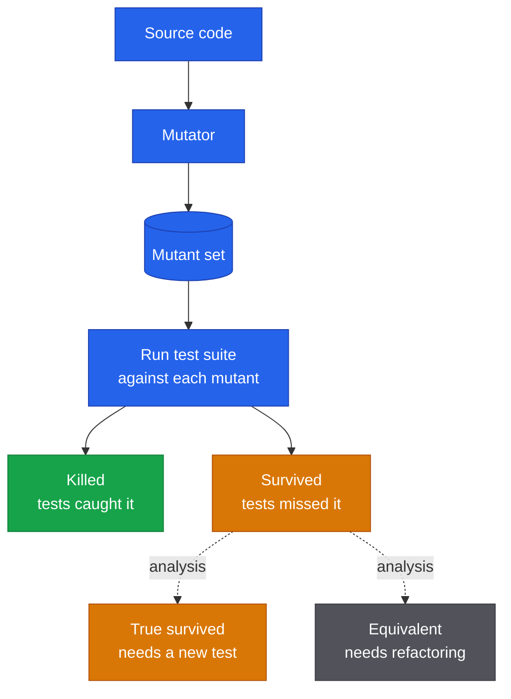
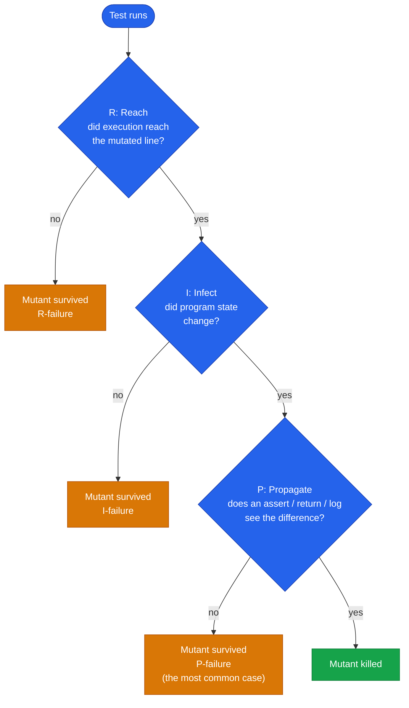

# Mutation Testing

In September 2025, auditors at [Trail of Bits](https://blog.trailofbits.com/2025/09/18/use-mutation-testing-to-find-the-bugs-your-tests-dont-catch/) reviewed the security of the Arkis protocol smart contract. The critical parameter-validation function was sitting at 100% test coverage. The tests were real — hand-written by humans, run on every CI build. Metrics: green. Picture: textbook-perfect.

Then the auditors ran mutation testing on the same code. They found a vulnerability that would have let attackers drain user funds.

Not a bug in the tests. Not a bug in the infrastructure. A bug in code that was "fully covered" and yet caught by nobody.

This article explains why this happens, what to do about it, and why mutation testing — an idea that's been around for fifty years — has suddenly turned from an academic curiosity into a practical engineering tool.

## What's wrong with code coverage

Code coverage is the most popular test-quality metric out there. A green "98% coverage" badge in your README looks impressive, and it usually comes with a comforting feeling that everything is under control.

The problem is that coverage doesn't measure what you think it measures.

Coverage tells you which lines of code **executed** during the test run. Not "were verified", not "are correct", not "behave as intended" — just executed. You can run a test through 100% of a function's lines and not make a single meaningful `assert`. The test exists, the metric is green, and the actual verification — isn't there.

::: tip Goodhart's Law
> "When a measure becomes a target, it ceases to be a good measure."

Goodhart's Law comes from economics, but it works one-to-one in testing: the moment a team starts chasing 100% coverage, tests appear whose only job is to walk the lines without failing. ([source](https://about.codecov.io/blog/mutation-testing-how-to-ensure-code-coverage-isnt-a-vanity-metric/))
:::

A few numbers, so this doesn't sound abstract:

- **Avito**, from their write-up on [rolling out mutation testing across 1,500 microservices](https://habr.com/ru/companies/avito/articles/650073/): the average <abbr title="Mutation Score Indicator">**MSI**</abbr> (a test quality metric; higher is better) was **64.8%**, while line coverage on the same codebase stayed reliably high.
- **OTUS**, a [field example on a PHP service](https://habr.com/ru/companies/otus/articles/580772/): **96% line coverage → 34% MSI**. Real bugs surfaced within thirty minutes of working through the surviving mutants.
- **Facebook**, a [study](https://arxiv.org/abs/2010.13464) on 15,000+ automatically generated mutants: **more than half** survived the company's rigorous internal test suite, which spans unit, integration, and end-to-end checks.

The gap between coverage and tests' actual ability to catch bugs isn't an exception in large codebases — it's the rule.

If we widen the sample with public data from the [Stryker Dashboard](https://dashboard.stryker-mutator.io/) and academic studies, the picture gets even sharper (sorted by MSI):

| Project | Context | MSI |
|---|---|---|
| [OTUS](https://habr.com/ru/companies/otus/articles/580772/) (PHP service) | 1000+ LOC, 96% line coverage | **34%** |
| [JFreeChart](https://arxiv.org/abs/1601.02351) (Java) | 47K LOC, 1320 tests | **41%** |
| [Facebook](https://arxiv.org/abs/2010.13464) | 15K mutants against a rigorous test suite | **~45%** |
| [Avito](https://habr.com/ru/companies/avito/articles/650073/) | 1500 microservices, 25K tests | **64.8%** |
| [Yii3](https://www.yiiframework.com/status/3.0) (91 packages) | open-source PHP, [Stryker Dashboard](https://dashboard.stryker-mutator.io/) | **66.7–100%, median 95.4%** |

MSI ranges from 34% (one PHP service) all the way to 100% (dozens of Yii3 packages), even though most of these projects keep line coverage at 90%+. Coverage simply doesn't see this difference: it would put them all in a tight cluster around 95% and slap the same green badge on every one.

::: tip The Yii3 ecosystem as a reference point
Out of [104 stable Yii3 packages](https://gist.github.com/roxblnfk/6bcee7b92b6fa328f192987341251a15), **91 publish data on the Stryker Dashboard**: average MSI **91.6%**, median **95.4%**, with **23 packages holding a perfect 100%** (router, csrf, aliases, definitions, widget, form, and others). The lowest scores belong to [view-twig](https://dashboard.stryker-mutator.io/reports/github.com/yiisoft/view-twig/master) (66.67%) and [log-target-file](https://dashboard.stryker-mutator.io/reports/github.com/yiisoft/log-target-file/master) (67.67%). It's a working example of systematic mutation testing baked into a development process across an entire ecosystem — not a personal initiative of one or two maintainers.
:::

The takeaway is simple: **coverage is a necessary but not a sufficient condition**. It's a useful sanity filter (if a function has 0% coverage, it's definitely untested), but not a quality gauge. And here's where a metric that measures what coverage stays silent about steps onto the stage — namely, how good your tests actually are.

## What is mutation testing

The idea, like many good ones, is deceptively simple: deliberately break the code and see whether the tests notice.

The algorithm:

1. Take the source code and apply a small change: replace `>` with `>=`, drop a statement, flip a condition. The result is a **mutant** — a program that differs from the original by one operation.
2. Run the existing test suite against the mutant.
3. If at least one test fails, the mutant is **killed**. The tests caught the change.
4. If all tests pass, the mutant **survived**. The tests missed it; you have a blind spot in that location.
5. Repeat for every possible mutation.

The fraction of killed mutants — the **Mutation Score Indicator (MSI)** — is the metric of test quality.



### Vocabulary

The minimal set of terms you'll see in any mutation report:

- **Mutation** — the change itself in the code (operator swap, line removal, etc.).
- **Mutator** (mutation operator) — the rule that generates a mutation. For example, "replace `>=` with `>`" is one mutator; "drop a void method call" is another.
- **Mutant** — a program with one mutation applied.
- **Killed / Survived** — respectively "tests caught the mutation" and "tests missed it".
- **Uncovered** (no coverage) — a mutation in code the tests never reach. Neither killed nor survived: nobody even tried to check it.
- **Timeout / Memory error** — a mutation drove a test into an infinite loop or ate up memory. Counted as killed (the test did "fail", just not gracefully), but typically broken out separately in the report.
- **Equivalent mutant** — a mutation that doesn't change program behaviour at all. There's a separate, unhappy conversation about these below.

Most introductory write-ups stop at killed/survived. If you've ever seen `Timeout` or `Uncovered` in an Infection report and wondered what they meant — now you know.


### Metrics

It's worth slowing down here because "MSI" means different things in different sources. Three formulas that often get confused:

| Metric | Formula | What it shows |
|---|---|---|
| **MSI** (Mutation Score Indicator) | `killed / total` | The most common interpretation. Every mutant the tests didn't kill (both survived and uncovered) counts as "tests didn't deliver". |
| **Mutation Code Coverage** | `(killed + survived) / total` | What share of mutants the tests touched at all. Roughly an analogue of regular coverage, expressed in mutants. |
| **Covered Code MSI** | `killed / (killed + survived)` | MSI restricted to mutants the tests actually reached. Almost always more optimistic than "overall" MSI. |

For one and the same run, these three numbers can differ severalfold. So if you're reading someone else's report and don't know which formula they used, it's easy to be misled. And when you show numbers to your own team, always say which exact metric you computed.

### A brief history

Lest mutation testing feel like a new fad: the idea is not new. Not new at all.

- **1971.** A student named Richard Lipton proposes mutation testing in a class paper.
- **1978.** Lipton, DeMillo, and Sayward publish ["Hints on Test Data Selection: Help for the Practicing Programmer"](https://www.computer.org/csdl/magazine/co/1978/04/01646911/13rRUx0gerz) — the first systematic paper on the topic. It's still cited by virtually every survey today.
- **1980.** Timothy Budd defends his PhD dissertation at Yale and writes the first working mutation testing tool.
- **1982.** Timothy Budd and Dana Angluin prove that automatically deciding whether a mutant is equivalent is **algorithmically undecidable**. That result still sets the upper ceiling for what any automated tool can hope to do.

#### The Mothra era

In the **mid-1980s** at Georgia Tech, a group led by Richard DeMillo built [Mothra](https://cs.gmu.edu/~offutt/rsrch/mut.html) — a full-fledged testing environment for Fortran-77, written in C. Most of the implementation was done by Jeff Offutt as part of his PhD work, the project was funded by the Rome Air Development Center, and the bulk of the development was completed in **1987**. Mothra then spread to universities — Purdue, Clemson, Bellcore, George Mason — and for decades served as the reference implementation of an academic mutation-testing infrastructure. Every modern tool inherits its blueprint, directly or indirectly.

Industry, however, didn't bite at that point: a full mutant run took hours, and on commercial codebases the scale quickly became prohibitive. Mutation testing settled in as an academic discipline with its own conference, its own ongoing arguments, and a healthy stack of publications.

#### The 2005 turning point

For a long time the strongest argument against the method was a simple one: "Are artificial mutations actually anything like real bugs?" If they aren't, the whole metric is meaningless.

In **2005**, Andrews, Briand, and Labiche published ["Is mutation an appropriate tool for testing experiments?" (ICSE 2005)](https://dl.acm.org/doi/10.1145/1062455.1062530). Empirically, they showed that mutations are a **valid proxy for real bugs**. Nine years later, [René Just](https://homes.cs.washington.edu/~rjust/) and co-authors repeated the study at much larger scale in ["Are Mutants a Valid Substitute for Real Faults in Software Testing?" (FSE 2014)](https://dl.acm.org/doi/10.1145/2635868.2635929) and confirmed it: a test suite's ability to kill mutants correlates with its ability to find real bugs. The "it's all just a toy" argument has been hard to defend ever since.

In parallel, the technique walked out of the Fortran world. In **2005–2006**, Yu-Seung Ma, Yong-Rae Kwon, and Jeff Offutt released [muJava](https://cs.gmu.edu/~offutt/mujava/) — the first mutation-testing tool for Java, with support for class-level operators (inheritance, polymorphism, overloading). From that point on, mutation testing stopped being tied to a single language.

#### Modern tooling

By the mid-2010s the technique was being picked up by engineers, not academics. Production-grade tools began to appear for the mainstream stacks:

- **2015.** Pádraic Brady writes [Humbug](https://github.com/humbug/humbug) — the first mutation-testing tool for PHP. The token-level implementation was slow, but it was the PHP community's first step.
- **2016.** Henry Coles presents [PIT (Pitest)](https://pitest.org/) at ISSTA 2016 as a ["practical mutation testing tool for Java"](https://researchrepository.ucd.ie/rest/bitstreams/22815/retrieve). PIT works at the bytecode level, runs only the tests relevant to each mutant, and is the first to ship an incremental mode. It's the de-facto standard in the JVM world today.
- **2017.** Maks Rafalko releases [Infection](https://infection.github.io/) — the successor to Humbug, built on the AST instead of tokens. Significantly faster than its predecessor, with support for PHPUnit, PhpSpec, and Codeception. Today Infection is the standard for the PHP ecosystem; it's the very tool that Testo plugs into via [`bridge-infection`](/docs/bridge/infection.md).
- Around the same time, [Stryker](https://stryker-mutator.io/) emerges for JavaScript, and later expands to TypeScript, .NET, and Scala.
- **2021.** [Google publishes](https://homes.cs.washington.edu/~rjust/publ/practical_mutation_testing_tse_2021.pdf) a report on practical mutation testing across 2 billion lines of code and 150 million daily test executions. The technique has officially crossed over from academia into production.


## A simple example

Explaining mutation testing without code is a bit like explaining recursion without recursion. Take a simple function — a letter grade by score:

```php
function gradeScore(int $score): string
{
    if ($score >= 90) return 'A';
    if ($score >= 80) return 'B';
    if ($score >= 70) return 'C';
    return 'F';
}
```

Now write the "obvious" test suite, one test per branch:

```php
public function testGrades(): void
{
    Assert::same('A', gradeScore(95));
    Assert::same('B', gradeScore(85));
    Assert::same('C', gradeScore(75));
    Assert::same('F', gradeScore(50));
}
```

Run coverage: **100% line coverage**. All four branches executed, no unreached lines. The README badge is earned.

Now run mutation testing. Among other things, the tool will generate these mutations:

- `$score >= 90` → `$score > 90`
- `$score >= 80` → `$score > 80`
- `$score >= 70` → `$score > 70`

All three mutants will **survive**.


Why? A test at 95 doesn't distinguish `>= 90` from `> 90`: 95 passes both ways. Same for 85 and 75. The boundary values — 90, 80, 70 — are the ones we never check. There's a blind spot exactly at the edges of the ranges.

Let's close it:

```php
public function testGradeBoundaries(): void
{
    Assert::same('A', gradeScore(90)); // lower bound for A
    Assert::same('B', gradeScore(80)); // lower bound for B
    Assert::same('C', gradeScore(70)); // lower bound for C
}
```

Now all three boundary mutants get killed: with `> 90` the function returns `'B'` instead of `'A'` for an input of 90, and the test catches it.

::: tip What just happened
Mutation testing forced us to think about the boundary cases — the ones tests typically stay quiet on, even though that's where the majority of real bugs live. Coverage didn't make us think about them. The mutation metric did.
:::

For an even more striking example, [a write-up on mutmut](https://habr.com/ru/company/vdsina/blog/512630/) walks through a clock-hand angle calculator. A test with **100% coverage** leaves **16 mutants** alive. Sixteen. On a function ten lines long.

## What kinds of mutations there are

A good mutation-testing tool keeps dozens of operators in its bag. They're organized by what they change, and that organization is useful to keep in your head — it tells you which classes of bugs you're hunting. Following [the Codecov classification](https://about.codecov.io/blog/mutation-testing-how-to-ensure-code-coverage-isnt-a-vanity-metric/), the operators fall into three big buckets.

### Value mutations

Swap constants and literals.

```php
// original           // mutant
$discount = 100;      $discount = 0;
$role = 'admin';      $role = '';
$factor = 1.5;        $factor = -1.5;
return true;          return false;
```

What they catch: tests that don't check the actual return value, only "something came back". The classic case is asserting on type or on "non-empty array", but never on contents.

### Statement mutations

"Statement" here is a language construct — a whole instruction (block, call, yield, return). The tool either removes a statement entirely or replaces it with a different one.

```php
// original                              // mutant
$user->save();                            // (call removed)
$result = compute() + adjust();           $result = compute();
return $a + $b;                           return $a;
return $a + $b;                           return null;
if ($user->isAdmin()) { ... }             if (true) { ... }
```

What they catch: tests that "accidentally" pass because everything around them was already in the right state. Removed `$user->save()` but the test stays green? Then nothing in the assertions actually checks the save itself. Replaced `return $a + $b` with `return null` and it still passed? The test isn't comparing the function's result; it's looking somewhere else entirely.

### Logic mutations

Flip conditions and boolean arithmetic.

```php
// original         // mutant
$a > $b             $a >= $b
$x && $y            $x || $y
$a == $b            $a != $b
!$valid             $valid
```

What they catch: blind spots at range boundaries and inside boolean joints — exactly what we saw in the `gradeScore` example.

In real tools the breakdown is, of course, finer-grained and more concrete. PIT (Java) calls its operators things like [Conditional Boundary, Math Mutator, Invert Negatives, Empty Returns, Void Method Call](https://pitest.org/quickstart/mutators/), and so on. Infection has [its own catalog](https://infection.github.io/guide/mutators.html) for PHP with dozens of rules.

### What else exists

The three groups above are the basic taxonomy worth keeping in mind. Modern tools, though, also catch subtler things.

#### Visibility and signatures

Infection **narrows** visibility: `public → protected → private`. It also strips nullable from type hints (`?int` → `int`) and changes return types. These mutations are particularly useful in library code, where it matters which parts of the public API are actually exercised by external tests.

```php
// original                              // mutant
public function calculate()               private function calculate()
function process(?User $u): void          function process(User $u): void
function items(): ?array                  function items(): array
```

::: warning Reads in reverse
Unlike with logic mutations, a "survived" visibility mutant is **not a signal to add a test** — it's a signal to look at the source itself.
:::

- **Mutant killed** (`public → private` → tests fail) = there's a test that calls the method from outside the class. The public contract is genuinely under test.
- **Mutant survived** (visibility narrowed, tests still pass) = no test invokes the method from the outside. From there, two scenarios:
  - the method doesn't actually need to be in the public API, so you can safely tighten it down to `protected`/`private` (over-exposure → source refactoring);
  - the method really is public, but **external** tests for it are missing, in which case you need a test that exercises it as part of the public contract.

The visibility mutator isn't hunting logic bugs — it's checking how cleanly your boundary between public and internal is drawn.

#### Arithmetic

Pure math operators: `+` → `-`, `*` → `/`, `<<` → `>>`, increment becomes decrement. PIT calls this group Math Mutator; Infection groups them under Arithmetic.

```php
// original                              // mutant
$total = $price + $tax;                   $total = $price - $tax;
for ($i = 0; $i < $n; $i++)               for ($i = 0; $i < $n; $i--)
```

#### Loops and control flow

Forced zero iteration (`while ($x)` → `while (false)`), inverted exit conditions, swapping `foreach` for `for`. They catch tests that pass "by accident" because the collection always had exactly one element, or because the loop always ran at least once.

#### Regular expressions

`[a-z]+` becomes `[a-z]*`, `^foo` loses its start-of-string anchor, `\d{3}` turns into `\d{2}`. This group is treacherous: it almost always generates a lot of equivalent mutants because different regexes often match the same set of test strings. On the other hand, a survived regex mutant is almost always a sign that your validation needs to be checked against unusual inputs.

#### Type casts

`(int)$value` → `(float)$value`, `(string)` → `(int)`. They check that data really arrives as the type you assumed — particularly relevant in PHP, where implicit type conversions in conditions are a frequent source of hidden bugs.

---

The full list of what Infection can do lives on [the mutators page](https://infection.github.io/guide/mutators.html). If you're not sure which operators to enable, start with the default set: there's already plenty there to chew on.

## Why this should work at all

At this point a reasonable question usually surfaces: "Seriously? Replacing `>` with `>=` is your scientific method? Real bugs are far more complicated than these tweaks."

Fair question. The answer is three classical hypotheses from the academic literature on mutation testing. They explain why "the trick with tiny substitutions" isn't a toy, but a valid way to gauge test quality.

### The RIP model

For a test to kill a mutation, three things must happen **in sequence**:

- **R**each — execution must reach the modified line.
- **I**nfect — the mutation must produce a difference in the program's internal state.
- **P**ropagate — that difference must reach an observable output: an `assert`, a return value, a side effect, a log entry.



The most common breakdown is at P. The test reached the mutated line, the mutation corrupted the state, but our `assert` doesn't observe that state, so the test passes. Coverage at this point will report 100%, while the mutation survives. The RIP model is a formal explanation of why "a line under coverage" still isn't "a line under verification".

### The coupling effect

A hypothesis confirmed many times empirically: tests that catch simple errors (mutations) also catch the **family of more complex** errors those simple ones combine into. A complex bug almost always decomposes into a combination of small mistakes — an operator mixed up here, a guard forgotten there, the wrong variable used somewhere else. Coverage of the simple case acts as a good proxy for coverage of the complex one.

This is the answer to the "why mutate only in tiny steps" question.

### The competent programmer hypothesis

Developers write code that is "almost correct". Real bugs in real commits aren't "completely wrong architecture" — they are small deviations from the correct version: an extra `=`, a swapped constant, a forgotten `null` check. Tiny mutations are a good proxy for exactly that class of bugs.

The hypothesis isn't perfect, of course (architectural disasters do happen), but on average across the industry it holds.

Together, these three theses build the case that mutation testing isn't a toy — it rests on an empirical model of how developers actually make mistakes.

## Cost and pitfalls

There's no silver bullet. Mutation testing has three real headaches: equivalent mutants as a theoretical ceiling, run-time cost, and the price of human report triage.

### Equivalent mutants

Sometimes a mutation **doesn't change program behaviour**. A simple example:

```php
// original
for ($i = 0; $i < count($items); $i++) { /* ... */ }

// mutant
for ($i = 0; $i != count($items); $i++) { /* ... */ }
```

Since `$i` is always non-negative here, `<` and `!=` behave identically. No test will ever kill that mutation, because the mutant is **behaviourally identical** to the original.

And here's the bad news: **in the general case, you cannot automatically tell an equivalent mutant from an ordinary survivor**. Timothy Budd and Dana Angluin proved this back in 1982: the problem is undecidable. In practice, on real-world projects, **between 4% and 39%** of mutants turn out to be equivalent.

::: question What do I do with a survived equivalent mutant?
If you've looked at it carefully and convinced yourself the mutation truly changes nothing, that's **a signal not to add a test, but to look at the source code**. An equivalent mutant often points at a redundant check, dead code, or a needless condition. A useful side effect of mutation testing: it nudges you toward refactoring.
:::

How do modern tools live with the problem? The systematic literature review by [Madeyski et al. (IEEE TSE, 2014)](https://ieeexplore.ieee.org/document/6613487/) singles out three approaches: <abbr title="Detect Equivalent Mutants">DEM</abbr> (detect them automatically), <abbr title="Suggest Equivalent Mutants">SEM</abbr> (suggest candidates to a human), <abbr title="Avoid Equivalent Mutant Generation">AEMG</abbr> (avoid generating them in the first place). All three combine: the default operator sets in Infection and PIT are AEMG out of the box, TCE and static analysis act as DEM on the report, and ML classifiers help focus manual review as SEM. None of them closes the problem completely (Budd–Angluin still stands), but together they bring the noise down to a manageable level.

::: question What is DEM — Detect Equivalent Mutants?
Techniques that run after mutant generation and try to prove that a specific mutant is behaviourally indistinguishable from the original. The most famous practical example is **TCE (Trivial Compiler Equivalence)** from [Papadakis et al. (ICSE 2015)](http://web4.cs.ucl.ac.uk/staff/Y.Jia/resources/papers/PapadakisJHT2015.pdf): the mutant is compiled to machine code or bytecode, and if the binary matches the original byte for byte, the mutation is equivalent up to compiler optimizations. No tests need to run at all. According to that paper, TCE catches roughly **30% of all equivalent mutants in C projects and up to 54% in Java**. The modern PHP variant of the same idea — knocking off survivors via static analysis (see below) — is essentially DEM, only the check happens against types and contracts rather than bytecode.
:::

::: question What is SEM — Suggest Equivalent Mutants?
Techniques that don't kill mutants automatically but rank them by how likely they are to be equivalent — so when a human triages the report, the most suspicious cases come first, while the obvious "non-equivalent" ones can wait. Methods used here include program slicing (if the modified line has no path through the dependency graph to the output, the mutation is suspect), constraint-based analysis, and increasingly [machine learning and LLMs](https://arxiv.org/html/2408.01760v1). These techniques are rarer in open-source tools — they're more interesting in research and in custom pipelines at large companies.
:::

::: question What is AEMG — Avoid Equivalent Mutant Generation?
The simplest and oldest approach: just don't generate the kinds of mutations that are most likely to turn out equivalent in the first place. **Selective mutation** disables noisy operators wholesale; **specialized mutation operators** restrict generation to narrow, pre-vetted patterns. This is exactly why the default mutator sets in [Infection](https://infection.github.io/guide/mutators.html) and [PIT](https://pitest.org/quickstart/mutators/) aren't "everything technically possible" but a deliberately trimmed-down subset. All three tools (Infection, PIT, Stryker) treat AEMG as the very first line of defence.
:::

### Speed

Mutation testing multiplies the test-run time by the number of mutants. Sounds harmless until you actually run into the numbers.

An example from [an academic survey](https://softengbook.org/articles/mutation-testing): JFreeChart, a Java library of about 47,000 lines. A full mutation run generated **256,000 mutants**, took **109 minutes**, and yielded an MSI of just 19%. An hour and a half on a single mid-sized library is already painful. On a million-line monorepo, it's a disaster.

People work around this in three ways.

**Only relevant tests per mutant.** This is PIT's approach in the JVM world, and it's also what Testo does via `bridge-infection`. For each mutant, Infection runs only the tests that cover the modified lines, using the filtering flags (`--filter` and `--path`). On large projects this brings a tens-of-times speed-up.

**Incremental mutation.** [Google's approach](https://homes.cs.washington.edu/~rjust/publ/practical_mutation_testing_tse_2021.pdf): on 2 billion lines of code and 150 million daily test runs, they only mutate the **diff** at code review time, never the whole codebase. Running across the whole repo there is physically impossible. The incremental version, however, sticks: 82–89% of the surfaced mutants are deemed useful by developers. The technique becomes a tool that operates directly inside PR review.

**Generation-time optimization.** In [muex for Elixir/Erlang](https://habr.com/ru/articles/1004240/), AST mutations happen at the bytecode level, and optimizations during generation (filtering out clearly uninteresting mutants) cut their number by 50–95% with minimal loss of accuracy. Infection and PIT do similar pruning.

::: info
Mutation testing became practical the moment tools learned to **selectively** run only the relevant tests against the relevant mutants, instead of grinding the entire suite for every substitution.
:::

### Less manual work

The most expensive step in mutation testing isn't the run; it's **report triage**. Sitting down and deciding, for each survived mutant: "is this equivalent or just a weak test?", "can it even be killed?", "is it worth a new assert?". This is exactly why the technique long carried a reputation for being expensive — even after fast runs became a solved problem, a mountain of manual triage remained.

The good news: that part of the process is being automated, fast. Some of the techniques are already shipping in production tools; others are arriving from the academic literature of the last few years. The underlying logic is the same in every case: after the test run, surviving mutants get pushed through one more automatic filter that kills them without human help. The only difference is **what** the filter looks at — static contracts, or the program's runtime state.

#### Static analysis

One practical trick is to push surviving mutants through a static analyzer. The idea is straightforward: if a mutation breaks the type system, violates an `@return` annotation, or makes a piece of code unreachable, we can mark the mutant as killed automatically — no new test needed. The canonical example from Infection's docs is a function annotated `@return list<T>` and the mutation `return array_values($values)` → `return $values`: behaviourally indistinguishable for the existing tests (the lists match on the test data), but `list<T>` is violated, and the static analyzer flags the mismatch immediately.

The approach isn't new: back in September 2020 Marco Pivetta (Ocramius) released [Roave/infection-static-analysis-plugin](https://github.com/Roave/infection-static-analysis-plugin), which adds Psalm support to Infection for exactly this purpose. Five years of production later, the idea has moved into the core itself: [Infection now supports static analysis out of the box](https://infection.github.io/guide/static-analysis-integration.html) — PHPStan since version 0.30.0, Mago since 0.32.7.

Strictly speaking, this isn't an "equivalent mutant detector": a mutant with a broken type isn't mathematically equivalent to the original — it's just one your existing tests don't expose. But the practical effect is the same as DEM approaches: fewer survivors that demand human triage.

#### Runtime state analysis

A parallel route — not static, but a comparison of program states during execution. The idea is laid out compellingly in [Du, Palepu, and Jones (ICSE 2025): "Leveraging Propagated Infection to Crossfire Mutants"](https://arxiv.org/abs/2411.09846). The authors call the technique **crossfiring**:

1. After the test run on the mutants, snapshots of memory state during execution of the original and the mutant are compared; the tool finds variables and fields whose values diverged.
2. From those divergences, **assertion candidates** are generated automatically — assertions that would notice the difference if added to the existing tests.
3. A greedy algorithm picks the smallest set of assertions that kills the most surviving mutants.

The logic mirrors static analysis: a survived mutant isn't necessarily equivalent — your current tests just don't observe the difference. The only difference is that static analysis hunts for type-contract violations, whereas crossfiring hunts for observable divergence in runtime state.

The numbers from the paper are striking: **84% of the surviving mutants in the study were killed simply by adding the right assertions** — without rewriting any test logic. And it does so by adding only **1.1% of all technically possible candidate assertions** (so the greedy optimization is highly selective). Compared with naïve test augmentation, crossfiring delivers a **6× improvement** in killed mutants.

In open-source tooling for PHP, Java, or JS, this isn't available yet — it's a 2025 research direction. But it's a useful pointer to where automation is heading: from "write the tests yourself" to "the tool proposes the assertion that kills the survivor".

#### LLM classification

The third — and youngest — route is to offload survivor triage onto large language models. The intuition is natural: LLMs handle code well, see the surrounding function and tests, and look like a natural fit for the role of "hey, is this mutation actually behaviourally equivalent, or do we just have a weak test?". In Madeyski's taxonomy this is either DEM (the model classifies survivors as equivalent or not on its own) or an aid to manual triage in the spirit of SEM (the model ranks suspects and the human walks the list top-down).

It sounds good. The numbers, so far — don't.

The most thorough empirical study on this is [Tian, Zhao et al. (2024): "Large Language Models for Equivalent Mutant Detection: How Far Are We?"](https://arxiv.org/html/2408.01760v1). The authors ran ten models against a benchmark of 3,302 Java mutants from MutantBench and got fairly sobering results.

If you simply pick GPT-4 and ask it via API to classify a mutant, you get an **<abbr title="F-measure: the harmonic mean of precision and recall, higher is better">F1</abbr> score in the 48–56% range** depending on whether you use <abbr title="prompting with no examples — the model has to solve the task from the prompt alone">zero-shot</abbr> or <abbr title="prompting with a few worked examples included in the prompt itself">few-shot</abbr> prompting. On a balanced dataset that's close to flipping a coin, and for production it isn't usable yet: "wire up ChatGPT and decide" doesn't work.

Real numbers only show up with specially trained models: a <abbr title="a model that has been further trained on a narrow dataset for a specific task">fine-tuned</abbr> UniXCoder reaches **F1 81.88%** at <abbr title="precision: the fraction of mutants the model labelled equivalent that really were">precision</abbr> 94.33% and <abbr title="recall: the fraction of all real equivalent mutants that the model found">recall</abbr> 81.81%. That's a respectable result, but the price is a separate infrastructure: a training pipeline, labelled data, a retraining cycle per language. Not "drop in and run".

On top of that, the benchmark itself is fairly artificial. It's Java only, and the equivalent-mutant ratio is artificially boosted to 17.8% — in real projects, equivalents tend to be sporadic. So even those 81.88% are a ceiling under favourable conditions, not a realistic estimate for a typical PHP codebase.

Bottom line: LLM triage hasn't reached production tools for PHP, Java, or JS — there's no Infection plugin doing this, and no equivalent in PIT or Stryker. But the direction is alive: benchmarks expand, new papers come out regularly, the numbers climb from publication to publication. For now it's a reason to keep an eye on the field, and once production plugins arrive — to give them a try.


## When to use it, when not

The technique is powerful, but it isn't free. The sensible strategy is to apply it surgically, not everywhere.

**Mutation testing pays off the most** in a few specific kinds of code:

- **Critical modules** — security, finance, the domain core, business-critical algorithms. The cost of a missed bug is high, and the cost of working through a few survivors is lower. The Arkis vulnerability uncovered by Trail of Bits illustrates the point: a single find can pay for years of runs.
- **Libraries and SDKs.** Packages that thousands of people rely on are worth the effort: a survived mutant here is effectively a bug report from your users-to-be.

**Where to hold off:**

- **Glue code, thin infrastructure wrappers, generated code, prototypes.** Too many of the mutants will be noise or equivalent.
- **Slow integration and end-to-end tests in the mutation loop.** If a single test takes 30 seconds, running 1,000 mutants takes 8 hours. Mutations belong on fast unit tests.

[The OTUS write-up](https://habr.com/ru/companies/otus/articles/580772/) catches the typical pitfalls well: excessive mutant generation on large projects, slow integration tests inside the loop, analysis paralysis when staring at a list of thousands of survivors. None of this makes the approach useless — it just means you have to be deliberate about where you turn it on.

The headline rule: mutation testing is a **targeted diagnostic tool**, not a blocking check that runs in CI on every PR. At least until tooling can do this incrementally (Google can; the rest are catching up).

::: question Is it OK to run mutation testing on every push in CI?
For most teams, no. A full mutation run is slow and noisy, and putting it on every push is a recipe for developers learning to ignore it. The healthy practice is one of: nightly runs against `main` with the report published, manual runs before a release, or — when the tooling supports it — incremental runs against the PR diff. A full per-push run only makes sense for libraries where test quality is itself the product.
:::

## Tools across ecosystems

The technique is language-agnostic. If you've landed here from outside the PHP world, there's almost certainly a tool for your stack, and it works on roughly the same principles.

- **PHP — [Infection](https://infection.github.io/).** The de-facto standard in the PHP ecosystem. It's the very tool Testo plugs into via [`bridge-infection`](/docs/bridge/infection.md).
- **Java/JVM — [PIT (Pitest)](https://pitest.org/).** Mature, very fast (works at the bytecode level), tightly integrated with Maven, Gradle, and JUnit. A rich [catalog of mutators](https://pitest.org/quickstart/mutators/).
- **JavaScript/TypeScript — [StrykerJS](https://stryker-mutator.io/).** Supports virtually the entire modern JS stack: TypeScript, React, Angular, Vue, Svelte, Node. The same project also offers [Stryker.NET](https://stryker-mutator.io/docs/stryker-net/introduction/) and [Stryker4s](https://stryker-mutator.io/docs/stryker4s/getting-started/) for Scala.
- **Python — [mutmut](https://github.com/boxed/mutmut).** A simple CLI with friendly output.
- **Elixir/Erlang — [muex](https://habr.com/ru/articles/1004240/).** Fresh, 2026.

If you're writing PHP and reading this, the next step is obvious: [hook up Infection through Testo's integration](/docs/bridge/infection.md), point it at a critical part of your code, and look at your first report.

## Further reading

If you want to dig deeper:

- **Theory and history.** The canonical survey by [Jia & Harman, 2011](https://web.eecs.umich.edu/~weimerw/2022-481F/readings/mutation-testing.pdf) covers roughly thirty years of the first development period of mutation testing. Its sequel — [Papadakis et al., 2019](https://mutationtesting.uni.lu/survey.pdf), 217 papers across 2008–2017.
- **Industrial scale.** [Petrović, Ivanković et al., *Practical Mutation Testing at Scale: A view from Google* (IEEE TSE, 2021)](https://homes.cs.washington.edu/~rjust/publ/practical_mutation_testing_tse_2021.pdf) — what mutation testing looks like on 2 billion lines of code.
- **Real-world cases.** [Trail of Bits on Arkis (2025)](https://blog.trailofbits.com/2025/09/18/use-mutation-testing-to-find-the-bugs-your-tests-dont-catch/) and [Avito on 1,500 microservices (2022)](https://habr.com/ru/companies/avito/articles/650073/).
- **Where automation is heading.** [Du, Palepu, Jones (ICSE 2025), "Leveraging Propagated Infection to Crossfire Mutants"](https://arxiv.org/abs/2411.09846) — a research direction that knocks off survivors via runtime state analysis.
- **A practitioner's introduction in Polish/English.** [Kamil Ruczyński, "Mutation testing — we are testing tests" (2019)](https://sarvendev.com/2019/06/mutation-testing-we-are-testing-tests/) — a clean, hands-on introduction with PHP examples.
