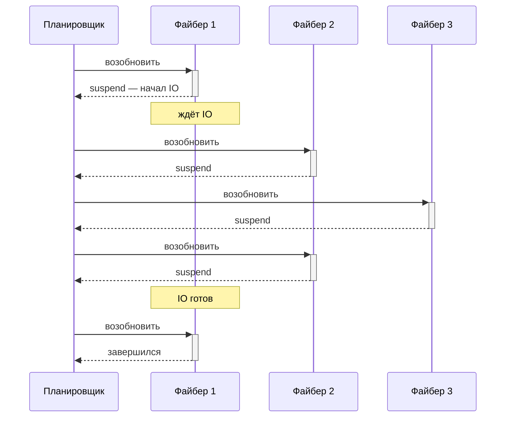
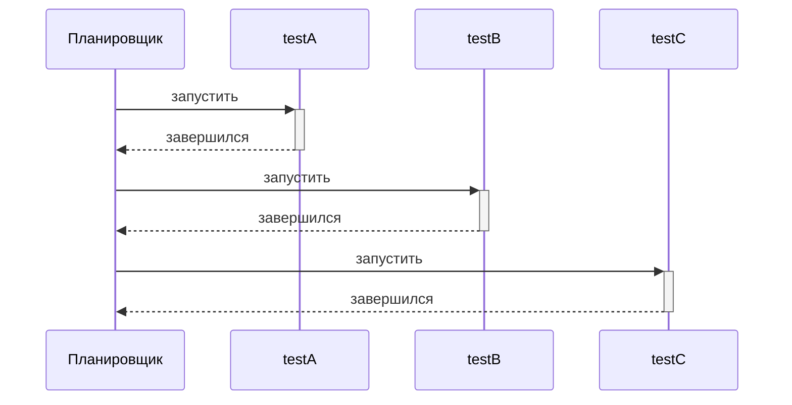
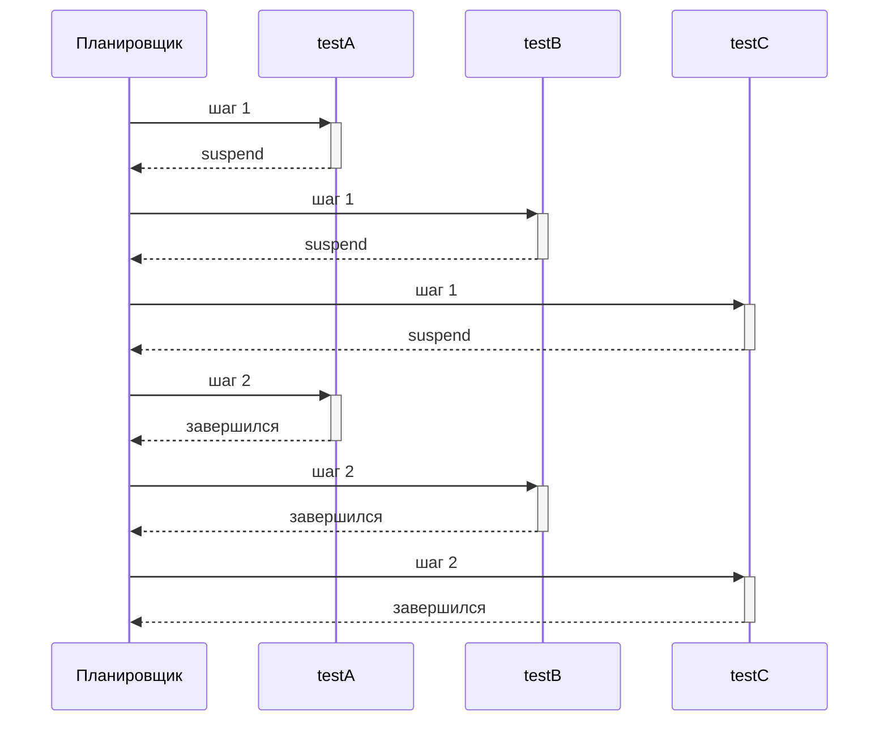

# Fiber — файберы и кооперативная конкурентность

Файбер — это функция, выполнение которой можно приостановить и позже возобновить с того же места, сохранив весь стек вызовов. В отличие от потоков, файберы кооперативные: они не выполняются параллельно и не вытесняют друг друга. Код сам решает, где уступить управление, вызвав `\Fiber::suspend()`. Появились в PHP 8.1; подробнее в [руководстве PHP](https://www.php.net/manual/ru/language.fibers.php).

Сам по себе файбер умеет только приостанавливаться, а решить, кого возобновить после `\Fiber::suspend()` и в каком порядке, он не может. Этим занимается **планировщик**: код поверх файберов, который держит их список, передаёт управление от одного к другому и доводит работу до конца. В асинхронных фреймворках эту роль обычно играет event loop, ждущий готовности ввода-вывода. Testo же использует свой кооперативный планировщик, заточенный под тесты.




Плагин Fiber запускает тесты внутри обычных PHP-файберов под управлением собственного кооперативного планировщика Testo, без event loop и без вытеснения. Он решает три задачи:
1. Выполнить тест в **отдельном файбере**, чтобы внутри работал `\Fiber::suspend()`, когда тест сам гоняет файберы или кооперативный код.
2. **Чередовать** тесты одного Test Case, чтобы ловить гонки (ошибки, зависящие от порядка выполнения).
3. Запускать **корутины внутри одного теста**, когда сценарию нужно несколько участников одновременно: продюсера и консьюмера, клиента и сервера.

<plugin-info name="Fiber" />

<signature h="2" name="#[\Testo\Fiber\RunInFiber(Schedule $schedule = Schedule::Solo)]">
<short>Запускает тест (метод) или все тесты кейса (класс) в файберах под кооперативным планировщиком Testo.</short>
<description>

Можно использовать на **методе** и **классе** (Test Case):

- на **методе** — только этот тест выполняется в собственном файбере; параметр <enum>\Testo\Fiber\Schedule</enum> для одиночного теста не имеет смысла и игнорируется;
- на **классе** — все тесты кейса планируются по выбранному <enum>\Testo\Fiber\Schedule</enum>: <enum>\Testo\Fiber\Schedule::Solo</enum> (каждый тест в своём файбере, один за другим, по умолчанию) либо кооперативное чередование <enum>\Testo\Fiber\Schedule::RoundRobin</enum> / <enum>\Testo\Fiber\Schedule::Random</enum>.

Уровни не конфликтуют: если атрибут уже стоит на классе, атрибут на методе второго файбера не создаёт, ведь тест и так запланирован кейсом.

Переключение **кооперативное**: планировщик передаёт управление другому файберу только там, где текущий вызывает `\Fiber::suspend()`. Event loop'а нет, вытеснения нет: тест, который ни разу не приостановился, никому не уступит.

Независимо от уровня тест получает **собственную область корутин**: <func>\Testo\Fiber\Coroutine::spawn()</func> добавляет корутины в его расписание. Подробнее в разделе [Корутины внутри теста](#корутины-внутри-теста).

</description>
<param name="$schedule">Как планировать тесты кейса (только на классе). На корутины внутри теста не влияет: они всегда чередуются по кругу.</param>
<example>

Здесь тест проверяет кооперативный драйвер, который сам вызывает `\Fiber::suspend()`. Такой код должен выполняться в файбере, и его запускает <attr>\Testo\Fiber\RunInFiber</attr>:

::: code-group
```php [Тест]
use Testo\Assert;
use Testo\Fiber\RunInFiber;
use Testo\Test;

#[Test]
#[RunInFiber]
public function runsCooperativeDriver(): void
{
    $job = new StepwiseJob();

    // StepwiseJob внутри вызывает \Fiber::suspend();
    $job->run();

    Assert::same($job->completed, ['fetch', 'process', 'store']);
}
```

```php [Драйвер]
// Тестируемый кооперативный код: между шагами уступает
// управление планировщику через \Fiber::suspend().
final class StepwiseJob
{
    /** @var list<string> */
    public array $completed = [];

    public function run(): void
    {
        foreach (['fetch', 'process', 'store'] as $step) {
            $this->completed[] = $step;
            \Fiber::suspend();     // точка кооперативного переключения
        }
    }
}
```
:::

</example>
</signature>

::: warning
Без <attr>\Testo\Fiber\RunInFiber</attr> тело теста выполняется вне какого-либо файбера, в главном потоке (`{main}`), где `\Fiber::getCurrent()` возвращает `null`. Приостанавливать там нечего: `\Fiber::suspend()` бросает `\FiberError` с сообщением «Cannot suspend outside of a fiber», и тест падает с ошибкой.
:::

## Чередование тестов кейса

<attr>\Testo\Fiber\RunInFiber</attr> на классе со стратегией <enum>\Testo\Fiber\Schedule::RoundRobin</enum> или <enum>\Testo\Fiber\Schedule::Random</enum> запускает все тесты кейса вместе, переключаясь между ними в точках `\Fiber::suspend()`. Так ловят гонки: пока один тест приостановлен, не доделав работу, другой успевает проверить общее для них состояние и застать его в промежуточном, ещё несогласованном виде.

При <enum>\Testo\Fiber\Schedule::Solo</enum> тесты идут встык, то есть последовательно: каждый доходит до конца, прежде чем стартует следующий:



При <enum>\Testo\Fiber\Schedule::RoundRobin</enum> те же тесты бегут вперемежку, по шагу за раунд. Общее время то же (параллелизма нет), но каждый тест теперь видит соседей на промежуточных стадиях:



::: question Датасеты, Retry и Repeat внутри теста тоже чередуются?
Нет. Чередуются только тесты между собой. Датасеты, а также попытки под <attr>\Testo\Retry</attr> и <attr>\Testo\Repeat</attr> в пределах одного теста идут последовательно. Почему так — в разделе [Один файбер на тест](#один-файбер-на-тест).
:::

<signature h="3" name="enum \Testo\Fiber\Schedule">
<short>Как планируются тесты Test Case под <attr>\Testo\Fiber\RunInFiber</attr>.</short>
<description>

Задаётся только на классе. Готовым считается тест, который ещё не завершился: на каждом шаге он выполняется до следующей приостановки.

</description>
<case name="Solo">**По умолчанию.** Тесты выполняются последовательно по одному.</case>
<case name="RoundRobin">По одному шагу каждому тесту за раунд, по порядку. Детерминированное чередование.</case>
<case name="Random">На каждом шаге выбирается случайный тест. Помогает вытрясать зависимости от порядка. Без сида прогоны не воспроизводимы.</case>
</signature>

::: question Если все тесты выполняются разом, то что будет в выводе терминала?
Вывод чередуемых тестов не перемешивается: терминал показывает каждый тест одним непрерывным блоком (узел, датасеты, стриминг `-vv`, строка результата). Блоки появляются в порядке завершения тестов.
:::

## Корутины внутри теста

Чередование решает задачу «несколько тестов одновременно». Но часто несколько участников нужны **внутри одного** теста: продюсер и консьюмер над общей очередью, клиент и сервер, воркер и тот, кто его останавливает. Запускать их вручную через `new \Fiber` можно, но тогда тест сам превращается в планировщик: приходится решать, кого и когда возобновлять, и руками собирать результаты и ошибки.

Поэтому каждый <attr>\Testo\Fiber\RunInFiber</attr>-тест получает **собственный планировщик**. Тело теста — его первая корутина, <func>\Testo\Fiber\Coroutine::spawn()</func> добавляет остальные в то же расписание. Они чередуются с телом теста и друг с другом в точках `\Fiber::suspend()`, а под классовым <attr>\Testo\Fiber\RunInFiber</attr> вся эта область продолжает чередоваться ещё и с остальными тестами кейса.

```php
use Testo\Assert;
use Testo\Fiber\Coroutine;
use Testo\Fiber\RunInFiber;
use Testo\Test;

#[Test]
#[RunInFiber]
public function awaitsCoroutineResult(): void
{
    // Побочная корутина работает вперемежку с телом теста
    $worker = Coroutine::spawn(static function (): int {
        // ... что-то считает, по пути уступая управление через \Fiber::suspend() ...
        return 42;
    });

    // ... тело теста тем временем занимается своим ...

    // Дожидаемся корутину и забираем её результат
    Assert::same($worker->await(), 42);
}
```

<signature h="3" name="\Testo\Fiber\Coroutine::spawn(\Closure|\Fiber $body): Coroutine">
<short>Добавляет корутину в область текущего теста.</short>
<description>

Корутина получает первый шаг в текущем раунде планирования, а дальше выполняется кооперативно: держит управление, пока не приостановится, не дождётся другой корутины или не завершится.

Вызывать можно откуда угодно внутри теста, в том числе из другой корутины: все они попадают в одну и ту же область.

Бросает `\LogicException`, если области нет (тест без <attr>\Testo\Fiber\RunInFiber</attr>), если переданный `\Fiber` уже запущен или если область уже закрывается, например, при попытке породить корутину из `finally` отменяемой корутины.

</description>
<param name="$body">Замыкание или **незапущенный** `\Fiber`. Значение, которое вернёт тело, станет результатом корутины.</param>
<example>

```php
$worker = Coroutine::spawn(static fn(): string => $server->acceptOne());
```

</example>
</signature>

<signature h="3" name="\Testo\Fiber\Coroutine::await(): mixed">
<short>Дожидается корутину и возвращает её результат.</short>
<description>

Приостанавливает вызвавшую корутину, пока ожидаемая не завершится; остальные корутины (и тесты кейса) продолжают выполняться. Если корутина уже завершилась, возвращает результат сразу.

Ошибку корутины `await()` пробрасывает завёрнутой в <class>\Testo\Fiber\Exception\CompositeException</class> и помечает как обработанную: повторно её область уже не покажет. Если корутина была отменена вместе с областью, пробрасывается <class>\Testo\Fiber\Exception\CancelledException</class>: результата у неё нет.

</description>
<example>

```php
$ping = Coroutine::spawn(static fn(): string => $client->send('ping'));

Assert::same($ping->await(), 'pong');
Assert::true($ping->isFinished());
```

</example>
</signature>

<signature h="3" name="\Testo\Fiber\Coroutine::concurrently(\Closure|\Fiber ...$bodies): array">
<short>Запускает переданные функции одновременно и дожидается их всех.</short>
<description>

Синтаксический сахар над <func>\Testo\Fiber\Coroutine::spawn()</func> + <func>\Testo\Fiber\Coroutine::await()</func>: добавляет всё в расписание текущей области, приостанавливает вызвавшую корутину до завершения последней и возвращает результаты с теми же ключами, что у аргументов: именованные аргументы дают строковые ключи.

Падение одной корутины не обрывает остальные: они доводятся до конца, после чего все ошибки собираются в одну <class>\Testo\Fiber\Exception\CompositeException</class>, с теми же ключами, что и результаты.

</description>
<param name="$bodies">Замыкания или незапущенные файберы. Передавайте именованными аргументами, чтобы получить понятные ключи в результатах и ошибках.</param>
<example>

```php
$results = Coroutine::concurrently(
    server: static fn(): string => $server->acceptOne(),
    client: static fn(): string => $client->send('ping'),
);

Assert::same($results['server'], 'ping');
```

</example>
</signature>

<signature h="3" name="\Testo\Fiber\Coroutine::isFinished(): bool">
<short>Завершилась ли корутина: вернула результат, упала или была отменена.</short>
</signature>

### Как планируются корутины

Внутри области всегда действует круговое расписание: за раунд каждая незавершённая корутина, включая тело теста, делает по одному шагу. Шаг длится до ближайшей приостановки: <func>\Fiber::suspend()</func>, <func>\Testo\Fiber\Coroutine::await()</func> или завершения. Стратегия из <attr>\Testo\Fiber\RunInFiber</attr> управляет только тем, как чередуются **тесты** между собой, и на корутины не распространяется.

Между раундами область отдаёт управление наружу. Благодаря этому корутины одного теста не «зажимают» кейс: под `#[RunInFiber(Schedule::RoundRobin)]` соседние тесты продолжают получать свои шаги, пока эти корутины работают.

### Область закрывается вместе с тестом

Корутины живут строго внутри теста, который их породил: он не считается завершённым, пока не завершились все корутины. Это принцип **структурированной конкурентности**: корутина не может пережить свой тест.

- Тело теста вернулось, а корутины ещё работают: планировщик доводит их до конца, и только потом тест закрывается.
- Тело теста **упало**: незавершённым корутинам в точке приостановки бросается <class>\Testo\Fiber\Exception\CancelledException</class>, чтобы отработали блоки `finally` и освободились ресурсы.

Не глушите отмену: корутина, поймавшая <class>\Testo\Fiber\Exception\CancelledException</class> и снова приостановившаяся, будет возобновлена ещё раз, чтобы дойти до конца, но кооперироваться ей больше не с кем: область уже закрывается.

::: warning Корутину нельзя «забыть»
Корутина, которую вы породили, но так и не дождались, всё равно будет выполнена до конца, а её падение уронит тест. Это осознанное решение: молча проглоченная ошибка в фоновой задаче хуже, чем упавший тест.
:::

### Ошибки корутин

Ошибки корутин **всегда** приходят завёрнутыми в <class>\Testo\Fiber\Exception\CompositeException</class>, даже если ошибка одна. Так обработка не зависит от того, упала одна корутина или три: исходные исключения лежат в свойстве `$errors`, а самое раннее продублировано в <func>\Throwable::getPrevious()</func>, поэтому обычные средства вывода всё равно покажут первопричину.

```php
use Testo\Fiber\Exception\CompositeException;

try {
    Coroutine::concurrently(
        server: static fn() => throw new \RuntimeException('порт занят'),
        client: static fn(): string => $client->send('ping'),
    );
} catch (CompositeException $e) {
    Assert::instanceOf($e->errors['server'], \RuntimeException::class);
}
```

Если ошибку корутины никто не дождался, она всплывает на уровне теста: успешный в остальном тест получает статус `Error`, а его причиной становится тот же <class>\Testo\Fiber\Exception\CompositeException</class>. Если тело теста тоже упало, оно сохраняет свой статус, а его ошибка встаёт в композит первой, как корень проблемы.

Само по себе исключение тела теста **не заворачивается**: когда корутины отработали чисто, оно проходит наверх как есть, поэтому <attr>\Testo\Assert\ExpectException</attr> над телом работает привычно. Заворачивание включается только тогда, когда есть что добавить из корутин.

### Взаимные ожидания

Корутины могут зациклиться на взаимном ожидании: A ждёт результата B, B ждёт результата C, а C ждёт A. Круг замкнулся, и завершиться не может никто — это взаимная блокировка (deadlock). Планировщик распознаёт такой цикл и разрывает его: в <func>\Testo\Fiber\Coroutine::await()</func> первой обречённой корутины бросается <class>\Testo\Fiber\Exception\DeadlockException</class>: трассировка указывает прямо на ожидание, замкнувшее цикл. Цикл распознаётся и тогда, когда он проходит через области **разных** тестов. Такое возможно, если под классовым <attr>\Testo\Fiber\RunInFiber</attr> тесты передают друг другу дескрипторы корутин.

Это работает только для <func>\Testo\Fiber\Coroutine::await()</func>: он единственный приостанавливает корутину так, что планировщик понимает, чего она ждёт. Голый цикл с `\Fiber::suspend()` в ожидании события, которое никогда не наступит, выглядит для планировщика обычной работой, и такой тест просто зависнет.

## Изоляция состояния

Testo привязывает состояние (проверки, сообщения, скоупы контейнера, покрытие и т.д.) к **выполняющемуся** тесту: при каждом переключении файберов состояние одного теста снимается, а другого подставляется. Поэтому проверки `Assert::*` внутри чередуемых тестов попадают каждый в свою историю, а не в чужую.

Это распространяется и на корутины: проверки, сообщения и покрытые строки из корутины засчитываются тому тесту, который её породил, на любой глубине вложенности и при любой стратегии. Так же ведут себя и файберы, которые тест создаёт и крутит сам.

Гарантия действует, пока тест выполняется. Файбер, который переживёт свой тест и будет возобновлён кем-то позже, на неё рассчитывать не может, поэтому не давайте вспомогательным файберам жить дольше теста. Корутинам теста это не грозит: тест дожидается их всех.

::: danger Внутри файберов работает только построчное покрытие (Line)
Уровни выше <enum>\Testo\Codecov\Config\CoverageLevel::Line</enum> (Branch и Path) включают анализ ветвей XDebug, а он внутри файбера портит память и роняет процесс. Баг сохраняется в актуальных сборках XDebug (воспроизводится на 3.5.3), поэтому для тестов под <attr>\Testo\Fiber\RunInFiber</attr> собирайте покрытие только на уровне Line.

Testo пытается перехватить небезопасный прогон и остановить тест исключением <class>\Testo\Codecov\Exception\BranchCoverageUnsafeInFiber</class>, но эта защита завязана на версию XDebug и срабатывает не на всех сборках, так что полагаться на неё нельзя.
:::

### Один файбер на тест

Датасеты одного теста и его попытки под <plugin>Retry</plugin> / <plugin>Repeat</plugin> идут **последовательно** и между собой не чередуются. Это искусственное ограничение, которое со временем может стать настраиваемым.

Причина в общих ресурсах: все датасеты выполняют один и тот же код, а значит почти наверняка работают с одними и теми же ресурсами, различаются лишь данные. С конкурирующими датасетами можно легко получить конфликты, а выигрыша от конкурентности не будет.

::: info
Планировщик Testo переключает файберы только в точках `\Fiber::suspend()` и не следит за таймерами, сокетами и готовностью ввода-вывода: event loop'а под <attr>\Testo\Fiber\RunInFiber</attr> нет.
:::

Если тестируемый код базируется на Revolt, воспользуйтесь <attr>\Testo\Bridge\Revolt\RunInRevolt</attr> из адаптера <plugin>Revolt</plugin>.

::: question RunInFiber или RunInRevolt?
<attr>\Testo\Fiber\RunInFiber</attr> — про **конкурентность**: чередовать тесты и корутины на обычных файберах, которыми управляет сам Testo, чтобы находить гонки в кооперативном коде. <attr>\Testo\Bridge\Revolt\RunInRevolt</attr> — про **асинхронность**: отдать тест event loop'у <plugin>Revolt</plugin>, чтобы он ждал реальный ввод-вывод. Это разные задачи: <attr>\Testo\Fiber\RunInFiber</attr> не крутит event loop, а <attr>\Testo\Bridge\Revolt\RunInRevolt</attr> не чередует тесты между собой.
:::

::: question Чем корутины отличаются от `new \Fiber` внутри теста?
Файбер, созданный вручную, вы возобновляете сами и сами решаете, когда и в каком порядке. Корутина попадает в расписание теста: планировщик сам даёт ей шаги вперемешку с телом теста, <func>\Testo\Fiber\Coroutine::await()</func> забирает результат, ошибки собираются и доводятся до отчёта, а тест не завершится, пока не завершатся все его корутины. Ручные файберы никуда не делись и продолжают работать: просто за их жизненный цикл отвечаете вы.
:::
