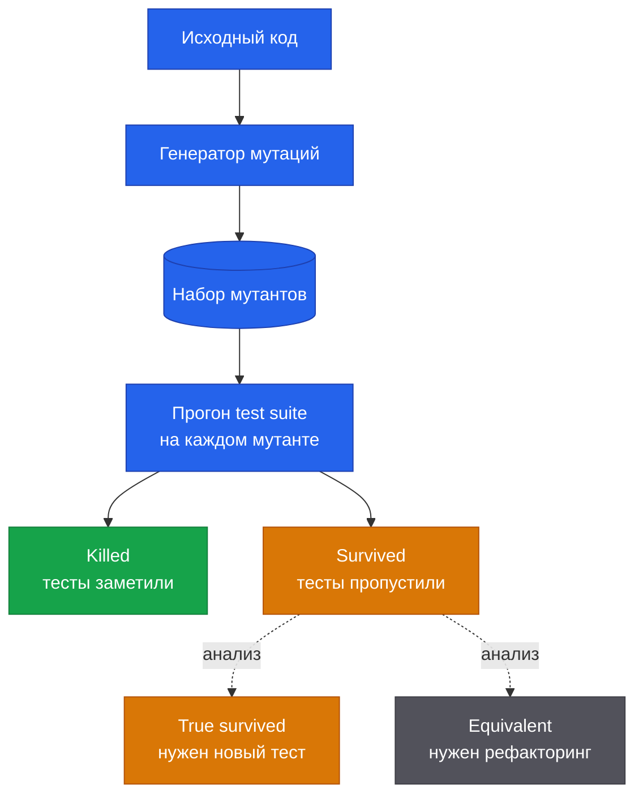
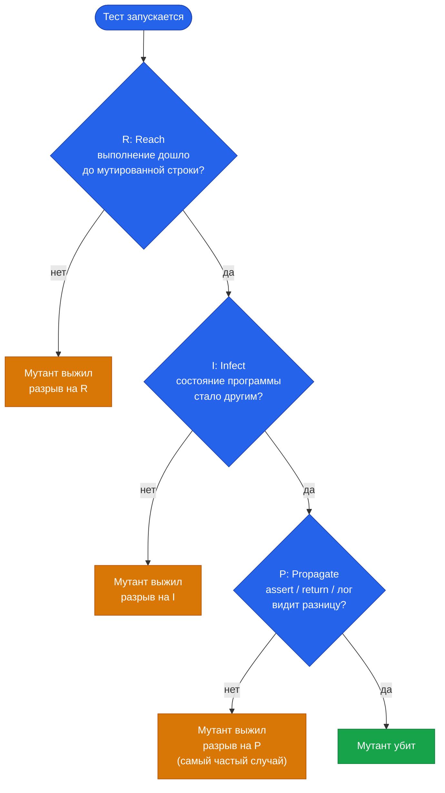

# Мутационное тестирование

В сентябре 2025 года команда аудиторов из [Trail of Bits](https://blog.trailofbits.com/2025/09/18/use-mutation-testing-to-find-the-bugs-your-tests-dont-catch/) проверяла безопасность смарт-контракта протокола Arkis. У кода в критичной функции валидации параметров было сто процентов покрытия. Тесты — настоящие, человеком написанные, регулярно прогоняемые в CI. Метрики — зелёные. Картина — образцовая.

А потом аудиторы прогнали по этому коду мутационное тестирование. И нашли уязвимость, через которую можно было увести деньги пользователей.

Не баг в тестах, не баг в инфраструктуре. Баг в коде, который был «полностью покрыт», но при этом никем не пойман.

В этой статье вы узнаете, почему так получается, что с этим делать и почему мутационное тестирование, идея пятидесятилетней давности, в последние годы внезапно стало практическим инструментом, а не академической темой.

## Что не так с покрытием кода

Code coverage — самая популярная метрика качества тестов. Зелёный бейдж «98% coverage» в README выглядит солидно, и обычно за ним следует ощущение «у нас всё под контролем».

Проблема в том, что покрытие меряет не то, что вы думаете.

Coverage показывает, какие строки кода **исполнились** во время прогона тестов. Не «были проверены», не «правильны», не «работают как задумано», а просто исполнились. Можно прогнать через тест 100% строк функции и при этом не сделать ни одного значимого `assert`. Тест есть, метрика зелёная, а реальной проверки — нет.

::: tip Закон Гудхарта
> «When a measure becomes a target, it ceases to be a good measure»

«Когда метрика становится целью, она перестаёт быть хорошей метрикой». Закон Гудхарта родом из экономики, но в тестировании работает один в один: как только команда начинает гнаться за coverage 100%, появляются тесты, чья единственная задача состоит в том, чтобы пройтись по строкам и не провалиться. ([источник](https://about.codecov.io/blog/mutation-testing-how-to-ensure-code-coverage-isnt-a-vanity-metric/))
:::

Несколько цифр, чтобы это не звучало абстрактно:

- **Avito**, по [опыту внедрения мутационного тестирования на 1500 микросервисов](https://habr.com/ru/companies/avito/articles/650073/): средний MSI оказался **64.8%** при стабильно высоком line coverage по той же кодовой базе.
- **OTUS**, [полевой пример на PHP-сервисе](https://habr.com/ru/companies/otus/articles/580772/): **96% line coverage → 34% MSI**. Реальные баги нашлись за полчаса анализа выживших мутантов.
- **Facebook**, [исследование](https://arxiv.org/abs/2010.13464) на 15 000+ автоматически сгенерированных мутантов: **больше половины** переживают строгий внутренний test suite, который покрывает unit-, integration- и end-to-end проверки.

Разрыв между покрытием и реальной отлавливающей способностью тестов в больших проектах — это не редкость, а правило.

Если расширить выборку и добавить публичные данные с [Stryker Dashboard](https://dashboard.stryker-mutator.io/) и из академических работ, картина становится ещё нагляднее (отсортировано по MSI):

| Проект | Контекст | MSI |
|---|---|---|
| [OTUS](https://habr.com/ru/companies/otus/articles/580772/) (PHP-сервис) | 1000+ LOC, line coverage 96% | **34%** |
| [JFreeChart](https://arxiv.org/abs/1601.02351) (Java) | 47K LOC, 1320 тестов | **41%** |
| [Facebook](https://arxiv.org/abs/2010.13464) | 15K мутантов на rigorous test suite | **~45%** |
| [Avito](https://habr.com/ru/companies/avito/articles/650073/) | 1500 микросервисов, 25K тестов | **64.8%** |
| [Yii3](https://www.yiiframework.com/status/3.0) (91 пакет) | open source PHP, [Stryker Dashboard](https://dashboard.stryker-mutator.io/) | **66.7–100%, медиана 95.4%** |

MSI скачет от 34% (один PHP-сервис) до 100% (десятки Yii3-пакетов), при том что у большинства line coverage 90%+. Coverage эту разницу не видит вообще: у всех был бы плотный кластер где-то у 95% и одинаковый «зелёный» бейдж.

::: tip Экосистема Yii3 как референс
Из 109 стабильных Yii3-пакетов **91 публикует данные на Stryker Dashboard**: средний MSI **91.8%**, медиана **95.4%**, и **24 пакета держат perfect 100%** (router, csrf, aliases, definitions, widget, form и другие). Минимум — у [view-twig](https://dashboard.stryker-mutator.io/reports/github.com/yiisoft/view-twig/master) (66.7%) и [log-target-file](https://dashboard.stryker-mutator.io/reports/github.com/yiisoft/log-target-file/master) (67.7%). Это пример того, как систематическое мутационное тестирование может быть встроено в процесс разработки на уровне всей экосистемы — а не быть личной инициативой пары мейнтейнеров. 
:::


Вывод раздела простой: **coverage — необходимое, но не достаточное условие**. Это полезный санитарный фильтр (если у функции 0% покрытия, она точно не тестируется), но не показатель качества. И тут на сцену выходит метрика, которая говорит то, о чём coverage молчит — насколько хороши ваши тесты на самом деле.

## Что такое мутационное тестирование

Идея, как и многие хорошие идеи, обманчиво проста: давайте намеренно ломать код и смотреть, заметят ли это тесты.

Алгоритм:

1. Берём исходный код и вносим в него маленькое изменение: заменяем `>` на `>=`, выкидываем строку, переворачиваем условие. Получается **мутант** — версия программы, отличающаяся от оригинала на одну операцию.
2. Прогоняем существующий test suite против мутанта.
3. Если хотя бы один тест упал, мутант **убит** (killed). Тесты заметили подмену.
4. Если все тесты прошли, мутант **выжил** (survived). Тесты подмену не заметили, у них в этом месте слепое пятно.
5. Повторяем для всех возможных мутаций.

**Mutation Score Indicator (MSI)**, или доля убитых мутантов, и есть та самая метрика качества тестов.



### Словарь

Минимальный набор терминов, которые встретятся в любом отчёте:

- **Мутация** (mutation) — само изменение в коде (замена оператора, удаление строки и т. п.).
- **Оператор мутации** (mutator) — правило, по которому генерируется мутация. Например, «заменять `>=` на `>`» — один оператор; «выбрасывать вызов метода с возвратом void» — другой.
- **Мутант** (mutant) — программа, в которую внесена одна мутация.
- **Killed / Survived** — соответственно «тесты заметили мутацию» и «не заметили».
- **Uncovered** (no coverage) — мутация в коде, до которого тесты вообще не добираются. Не killed и не survived: просто никто её не пытался проверить.
- **Timeout / Memory error** — мутация уронила тест в бесконечный цикл или сожрала память. Засчитывается как killed (ведь тест действительно «упал», хоть и нештатно), но в отчёте выделяется отдельно.
- **Equivalent mutant** — мутация, которая никак не меняет поведение программы. Об этом отдельный, неприятный разговор ниже.

Во вводных статьях обычно ограничиваются killed/survived. Если вы видите в отчёте Infection статус `Timeout` или `Uncovered`, то теперь знаете, что это значит.


### Метрики

Здесь стоит остановиться, потому что под одним и тем же словом «MSI» в разных источниках понимают разное. Три формулы, которые часто путают:

| Метрика | Формула | Что показывает |
|---|---|---|
| **MSI** (Mutation Score Indicator) | `killed / total` | Самая распространённая интерпретация. Все мутанты, которых тесты не убили (survived и непокрытые), считаются как «тесты не справились». |
| **Mutation Code Coverage** | `(killed + survived) / total` | Какая доля мутантов вообще была затронута тестами хоть как-то. По сути, аналог обычного coverage, но в терминах мутаций. |
| **Covered Code MSI** | `killed / (killed + survived)` | MSI среди тех мутантов, до которых тесты добрались. Часто оптимистичнее «общего» MSI. |

Для одного и того же прогона эти три цифры могут различаться многократно. Поэтому если читаете чужой отчёт и не знаете, какую формулу использовали, легко обмануться. А когда показываете цифры собственной команде, всегда проговаривайте, какую конкретно метрику посчитали.

### Краткая история

Чтобы не оставалось ощущения «новомодная штучка»: идея не новая. Совсем не новая.

- **1971.** Студент по имени Richard Lipton предлагает мутационное тестирование в курсовой работе.
- **1978.** Lipton, DeMillo и Sayward публикуют [«Hints on Test Data Selection: Help for the Practicing Programmer»](https://www.computer.org/csdl/magazine/co/1978/04/01646911/13rRUx0gerz) — первую системную статью по теме. Эту работу до сих пор цитируют практически все обзоры.
- **1980.** Timothy Budd защищает в Yale диссертацию и пишет первый работающий инструмент мутационного тестирования.
- **1982.** Timothy Budd и Dana Angluin доказывают, что задача автоматического определения equivalent-мутанта **алгоритмически неразрешима**. Этот результат до сих пор задаёт верхний потолок того, что может автоматический инструмент.

#### Эра Mothra

В **середине 1980-х** в Georgia Tech группа под руководством Richard DeMillo строит [Mothra](https://cs.gmu.edu/~offutt/rsrch/mut.html) — полноценный testing environment для Fortran-77, написанный на C. Большую часть реализации делает Jeff Offutt в рамках своей PhD-диссертации, проект финансируется Rome Air Development Center, а основная разработка завершается в **1987 году**. После этого Mothra расходится по университетам — Purdue, Clemson, Bellcore, George Mason — и на десятилетия становится эталоном академической инфраструктуры мутационного тестирования. Все современные инструменты прямо или косвенно унаследовали её формат.

В индустрию метод тогда не пошёл: прогон полного набора мутантов занимал часы, а на коммерческом коде масштаб быстро становился неподъёмным. Мутационное тестирование закрепилось как академическая дисциплина с собственной конференцией, своими спорами и большим набором публикаций.

#### Перелом 2005-го

Главным аргументом против подхода долгое время оставался простой вопрос: «а действительно ли искусственные мутации похожи на настоящие баги?». Если нет, то и метрика бессмысленна.

В **2005 году** Andrews, Briand и Labiche публикуют [«Is mutation an appropriate tool for testing experiments?» (ICSE 2005)](https://dl.acm.org/doi/10.1145/1062455.1062530). Они эмпирически показывают, что мутации — **валидный proxy для настоящих багов**. Девять лет спустя [René Just](https://homes.cs.washington.edu/~rjust/) и соавторы повторяют исследование на больших масштабах в [«Are Mutants a Valid Substitute for Real Faults in Software Testing?» (FSE 2014)](https://dl.acm.org/doi/10.1145/2635868.2635929) и подтверждают: способность тестов убивать мутантов коррелирует со способностью находить реальные баги. Аргумент «это всё игрушка» становится трудно защищаемым.

Параллельно метод выходит из Fortran-мира. В **2005–2006 годах** Yu-Seung Ma, Yong-Rae Kwon и Jeff Offutt выпускают [muJava](https://cs.gmu.edu/~offutt/mujava/) — первый инструмент мутационного тестирования для Java, причём с поддержкой class-level операторов (наследование, полиморфизм, перегрузка). С этого момента мутационное тестирование перестаёт быть привязано к одному языку.

#### Современный инструментарий

В середине 2010-х за метод берутся уже не академики, а инженеры. Появляются производственные инструменты для мейнстримных стеков:

- **2015.** Pádraic Brady пишет [Humbug](https://github.com/humbug/humbug) — первый инструмент мутационного тестирования для PHP. Реализация на уровне токенов получилась медленной, но это первый шаг для PHP-сообщества.
- **2016.** Henry Coles презентует [PIT (Pitest)](https://pitest.org/) на ISSTA 2016 как [«practical mutation testing tool for Java»](https://researchrepository.ucd.ie/rest/bitstreams/22815/retrieve). PIT работает на байткоде, для каждого мутанта запускает только релевантные тесты и первым внедряет инкрементальный режим. Сегодня это стандарт де-факто в JVM-мире.
- **2017.** Maks Rafalko публикует [Infection](https://infection.github.io/) — преемник Humbug, основанный на AST вместо токенов. Он существенно быстрее предшественника и поддерживает PHPUnit, PhpSpec и Codeception. Сегодня Infection — стандарт PHP-экосистемы; именно его Testo подключает через [`bridge-infection`](/ru/docs/bridge/infection.md).
- Тогда же появляется [Stryker](https://stryker-mutator.io/) для JavaScript, позже расширяется на TypeScript, .NET и Scala.
- **2021.** [Google публикует](https://homes.cs.washington.edu/~rjust/publ/practical_mutation_testing_tse_2021.pdf) отчёт о практическом мутационном тестировании на 2 миллиардах строк кода и 150 миллионах ежедневных тестов. Подход окончательно перешёл из академии в production.


## Простой пример

Объяснять мутационное тестирование без кода — это как объяснять рекурсию без рекурсии. Возьмём простую функцию: расчёт буквенной оценки по баллам.

```php
function gradeScore(int $score): string
{
    if ($score >= 90) return 'A';
    if ($score >= 80) return 'B';
    if ($score >= 70) return 'C';
    return 'F';
}
```

Пишем «очевидный» test suite, по одному тесту на каждую ветку:

```php
public function testGrades(): void
{
    Assert::same('A', gradeScore(95));
    Assert::same('B', gradeScore(85));
    Assert::same('C', gradeScore(75));
    Assert::same('F', gradeScore(50));
}
```

Запускаем покрытие: **100% line coverage**. Все четыре ветки исполнились, ни одной непокрытой строки. Зелёный бейдж в README заслужен.

Теперь прогоняем мутационное тестирование. Среди прочего инструмент сгенерирует такие мутации:

- `$score >= 90` → `$score > 90`
- `$score >= 80` → `$score > 80`
- `$score >= 70` → `$score > 70`

Все три мутанта **выживут**.


Почему? Тест на отметке 95 не отличает `>= 90` от `> 90`: 95 проходит и так, и эдак. То же для 85 и 75. Граничные значения — 90, 80, 70 — мы не проверяем. На границах диапазонов — слепое пятно.

Закроем его:

```php
public function testGradeBoundaries(): void
{
    Assert::same('A', gradeScore(90)); // нижняя граница A
    Assert::same('B', gradeScore(80)); // нижняя граница B
    Assert::same('C', gradeScore(70)); // нижняя граница C
}
```

Теперь все три boundary-мутации убиваются: при `> 90` функция вернёт `'B'` вместо `'A'` для входа 90, тест поймает.

::: tip Что произошло
Мутационное тестирование заставило нас задуматься о граничных случаях, на которых тесты обычно молчат, а в реальном коде именно они и оказываются местом большинства багов. Coverage этого не сделал. Мутационная метрика — сделала.
:::

В качестве ещё более яркого примера: [статья про mutmut на Хабре](https://habr.com/ru/company/vdsina/blog/512630/) разбирает функцию расчёта угла стрелок часов. Тест с **100% покрытием** оставляет в живых **16 мутантов**. Шестнадцать. На функции в десяток строк.

## Какие бывают мутации

Хороший инструмент мутационного тестирования держит в загашнике десятки операторов. Они систематизируются по тому, что меняют, и эту систематику удобно держать в голове, чтобы понимать, на какие классы багов вы охотитесь. По [классификации Codecov](https://about.codecov.io/blog/mutation-testing-how-to-ensure-code-coverage-isnt-a-vanity-metric/), всё разбивается на три большие группы.

### Мутации значений

Подменяют константы и литералы.

```php
// исходник           // мутант
$discount = 100;      $discount = 0;
$role = 'admin';      $role = '';
$factor = 1.5;        $factor = -1.5;
return true;          return false;
```

Что ловят: тесты, которые не проверяют конкретное значение результата, а только «что-нибудь вернулось». Классика — assert на тип или на «не пустой массив», но не на содержимое.

### Мутации операторов

«Оператор» здесь — это statement, т.е. языковая конструкция или целая инструкция (блок кода, вызов, yield, return). Инструмент либо удаляет statement целиком, либо заменяет его на другой.

```php
// исходник                            // мутант
$user->save();                          // (вызов удалён)
$result = compute() + adjust();         $result = compute();
return $a + $b;                         return $a;
return $a + $b;                         return null;
if ($user->isAdmin()) { ... }           if (true) { ... }
```

Что ловят: тесты, которые «случайно» проходят за счёт того, что вокруг и так всё было в нужном состоянии. Удалили `$user->save()` — тест всё равно зелёный? Значит, в `assert` именно сохранение никто не проверяет. Заменили `return $a + $b` на `return null` — снова прошло? Тест не сверяет результат функции, а смотрит куда-то ещё.

### Мутации логики

Переворачивают условия и булеву арифметику.

```php
// исходник         // мутант
$a > $b             $a >= $b
$x && $y            $x || $y
$a == $b            $a != $b
!$valid             $valid
```

Что ловят: слепые пятна на границах диапазонов и в логических связках — ровно то, что мы видели на примере с `gradeScore`.

В реальных инструментах это разделение, конечно, мельче и конкретнее. У PIT (Java) операторы называются [Conditional Boundary, Math Mutator, Invert Negatives, Empty Returns, Void Method Call](https://pitest.org/quickstart/mutators/) и так далее. У Infection [свой каталог](https://infection.github.io/guide/mutators.html) для PHP с десятками правил.

### Что ещё бывает

Перечисленные три группы — это базовая систематика, по которой удобно мыслить. Но современные инструменты держат в каталоге и более тонкие вещи.

#### Видимость и сигнатуры

Infection **сужает** видимость: `public → protected → private`. Также убирает nullable из type hint (`?int` → `int`) или меняет возвращаемый тип. Такие мутации полезны в библиотечном коде, где важно понимать, какая часть публичного API реально используется внешними тестами.

```php
// исходник                            // мутант
public function calculate()             private function calculate()
function process(?User $u): void        function process(User $u): void
function items(): ?array                function items(): array
```

::: warning Читается в обратную сторону
В отличие от логических мутаций, у visibility-мутантов «выживший» — это **не сигнал дописать тест**, а сигнал посмотреть на сам код.
:::

- **Мутант убит** (`public → private` → тесты упали) = у вас есть тест, который вызывает метод снаружи класса. Публичный контракт реально проверяется — всё ок.
- **Мутант выжил** (видимость сузилась, тесты прошли) = ни один тест не дёргает метод извне. Дальше — два сценария:
  - метод вообще не нужен в публичном API, можно безболезненно сделать его `protected`/`private` (over-exposure → рефакторинг исходника);
  - метод действительно публичный, но **внешних** тестов на него нет, и тогда нужен тест, который вызывает его именно как часть публичного контракта.

Visibility-мутатор не ищет логические баги в коде — он проверяет, насколько правильно у вас оформлена граница между публичным и внутренним.

#### Арифметика

Чисто математические операторы: `+` → `-`, `*` → `/`, `<<` → `>>`, инкремент → декремент. У PIT эта группа называется Math Mutator, у Infection — категория Arithmetic.

```php
// исходник                            // мутант
$total = $price + $tax;                 $total = $price - $tax;
for ($i = 0; $i < $n; $i++)             for ($i = 0; $i < $n; $i--)
```

#### Циклы и поток управления

Принудительная нулевая итерация (`while ($x)` → `while (false)`), переворот условия выхода, замена `foreach` на `for`. Ловят тесты, которые «случайно» проходят за счёт того, что в коллекции всегда был один элемент или цикл всегда выполнялся хотя бы раз.

#### Регулярные выражения

Вместо `[a-z]+` подставляется `[a-z]*`, `^foo` теряет якорь начала строки, `\d{3}` превращается в `\d{2}`. Группа коварная: почти всегда генерирует много equivalent-мутантов, потому что разные regex часто матчатся на одних и тех же тестовых строках. Зато выживший regex-мутант — почти всегда сигнал, что валидацию надо проверять на нестандартных входах.

#### Касты типов

`(int)$value` → `(float)$value`, `(string)` → `(int)`. Проверяют, что данные приходят именно того типа, который вы предполагали, — в PHP это особенно актуально, потому что неявные приведения типов в условиях постоянно прячут баги.

---

Полный список того, что Infection умеет, — на [странице мутаторов](https://infection.github.io/guide/mutators.html). Если сомневаетесь, какие операторы включать, начните с дефолтного набора: на нём уже есть что обсудить.

## Почему это вообще должно работать

В этом месте у читателя обычно возникает разумный вопрос: «Серьёзно? Заменить `>` на `>=` — это и есть научный метод? А реальные баги ведь куда сложнее, чем такие подмены».

Вопрос справедливый. Ответ на него — три классические гипотезы из академической литературы по мутационному тестированию. Они объясняют, почему «трюк с маленькими подменами» — это не игрушка, а валидный способ померить качество тестов.

### RIP-модель

Чтобы тест убил мутацию, должны произойти три вещи **подряд**:

- **R**each — выполнение должно дойти до изменённой строки.
- **I**nfect — мутация должна вызвать различие во внутреннем состоянии программы.
- **P**ropagate — это различие должно дойти до наблюдаемого выхода: `assert`, возвращаемого значения, побочного эффекта, лога.



Самый частый разрыв — на P. Тест дошёл до мутированной строки, мутация испортила состояние, но в `assert` мы это состояние не наблюдаем, и тест проходит. Coverage в этой точке покажет 100%, а мутация выживет. RIP-модель — формальное объяснение, почему «строка под coverage» — это всё ещё не «строка под проверкой».

### Coupling Effect

Гипотеза, многократно подтверждённая эмпирически: тесты, которые ловят простые ошибки (мутации), также ловят **семейство более сложных** ошибок, в которые эти простые «складываются». Сложный баг почти всегда декомпозируется в комбинацию маленьких ошибок: где-то перепутали оператор, где-то забыли проверку, где-то не той переменной воспользовались. Покрытие простых служит хорошим proxy для покрытия сложных.

Это и есть ответ на вопрос «зачем мутировать только маленькими шагами».

### Competent Programmer Hypothesis

Разработчики пишут «почти правильный» код. Реальные баги в коммитах — это не «полностью неправильная архитектура», а небольшие отклонения от правильного: лишний `=`, перепутанная константа, забытая проверка `null`. Маленькие мутации — это хороший proxy для именно этого класса багов.

Гипотеза, конечно, не идеальна (бывают и архитектурные катастрофы), но в среднем по индустрии работает.

Эти три тезиса вместе и складываются в обоснование: метод не игрушечный, а основанный на эмпирической модели того, как разработчики ошибаются.

## Цена и подводные камни

Серебряных пуль не бывает. У мутационного тестирования есть три большие беды: equivalent mutants как теоретический потолок, скорость прогона и стоимость ручного разбора отчёта.

### Equivalent mutants

Иногда мутация **не меняет поведения программы**. Простой пример:

```php
// исходник
for ($i = 0; $i < count($items); $i++) { /* ... */ }

// мутант
for ($i = 0; $i != count($items); $i++) { /* ... */ }
```

При неотрицательных значениях `$i` (а $i здесь всегда неотрицательное) `<` и `!=` ведут себя одинаково. Никакой тест эту мутацию не убьёт, потому что мутант **поведенчески идентичен** оригиналу.

И вот плохая новость: **в общем случае нельзя автоматически отличить equivalent-мутанта от обычного выжившего**. Timothy Budd и Dana Angluin доказали это ещё в 1982 году: задача неразрешима. На практике в реальных проектах равно эквивалентным оказывается **от 4% до 39%** мутантов.

::: question Что делать с выжившим equivalent mutant?
Если внимательно посмотрели и поняли, что мутация действительно ничего не меняет, это **сигнал не дописывать тест, а посмотреть на исходник**. Equivalent mutant часто указывает на лишнюю проверку, мёртвый код или избыточное условие. Полезный побочный эффект мутационного тестирования: оно провоцирует рефакторинг.
:::

Как с этим живут современные инструменты? Работа [Madeyski et al. (IEEE TSE, 2014)](https://ieeexplore.ieee.org/document/6613487/) — систематический обзор литературы — выделяет три подхода: <abbr title="Detect Equivalent Mutants">DEM</abbr> (детектировать автоматически), <abbr title="Suggest Equivalent Mutants">SEM</abbr> (предлагать кандидатов человеку), <abbr title="Avoid Equivalent Mutant Generation">AEMG</abbr> (избегать генерации). Все три комбинируются: дефолты Infection и PIT реализуют AEMG ещё на старте, TCE и статанализ работают как DEM на отчёте, ML-классификаторы помогают сфокусировать ручной разбор как SEM. Ни одна из этих линий не решает проблему до конца: теорема Budd–Angluin о неразрешимости никуда не делась. Но в комбинации они снижают шум до уровня, с которым можно жить.

::: question Что такое DEM — Detect Equivalent Mutants?
Техники, которые запускаются после генерации мутантов и пытаются доказать, что конкретный мутант поведенчески неотличим от оригинала. Самый известный практический приём — **TCE (Trivial Compiler Equivalence)** из работы [Papadakis et al. (ICSE 2015)](http://web4.cs.ucl.ac.uk/staff/Y.Jia/resources/papers/PapadakisJHT2015.pdf): мутант компилируется в машинный код или байткод, и если бинарь совпадает с оригиналом байт-в-байт, мутация эквивалентна с точностью до оптимизаций компилятора. Тесты прогонять не нужно вообще. По их данным, TCE ловит около **30% всех equivalent-мутантов в C-проектах и до 54% в Java**. Современная PHP-вариация того же подхода — добивание выживших через статанализ (см. ниже): по сути это DEM, только проверка идёт не на байткоде, а на типах и контрактах.
:::

::: question Что такое SEM — Suggest Equivalent Mutants?
Техники, которые не убивают мутантов автоматически, а ранжируют их по вероятности оказаться equivalent — чтобы при разборе отчёта человек смотрел в первую очередь на самых подозрительных, а очевидные «не-equivalent» оставлял на потом. Применяется program slicing (если изменённая строка никак не влияет на выход через граф зависимостей — мутация под подозрением), constraint-based анализ, в последние годы — [машинное обучение и LLM](https://arxiv.org/html/2408.01760v1). В open source-инструментах эти техники встречаются реже, чем DEM — они интереснее в исследовательском контексте и в кастомных пайплайнах больших компаний.
:::

::: question Что такое AEMG — Avoid Equivalent Mutant Generation?
Самый простой и самый старый подход: исключить из набора те виды мутаций, которые статистически чаще всего оказываются equivalent. **Selective mutation** отключает «шумные» операторы целиком, **specialized mutation operators** ограничивают генерацию узкими, заранее проверенными паттернами. Именно поэтому дефолтные наборы операторов в [Infection](https://infection.github.io/guide/mutators.html) и [PIT](https://pitest.org/quickstart/mutators/) — это не «всё, что технически возможно», а сознательно усечённое подмножество. Все три инструмента (Infection, PIT, Stryker) применяют AEMG как самую первую линию обороны.
:::

### Скорость

Мутационное тестирование умножает время прогона тестов на число мутантов. Звучит безобидно, пока не сталкиваешься с числами.

Пример из [академического обзора](https://softengbook.org/articles/mutation-testing): JFreeChart, библиотека на 47 тысяч строк Java-кода. Полный прогон мутаций сгенерировал **256 000 мутантов**, занял **109 минут** и дал MSI всего 19%. Полтора часа на одну библиотеку среднего размера — это уже плохо. На монорепе на миллион строк это уже катастрофа.

С этим работают разными способами:

**Только релевантные тесты на каждый мутант.** Это и подход PIT в Java-мире, и то, что Testo делает через `bridge-infection`. Для каждого мутанта Infection запускает только те тесты, которые покрывают изменённые строки, используя флаги фильтрации (`--filter` и `--path`). На больших проектах это даёт ускорение в десятки раз.

**Инкрементальная мутация.** Подход [Google](https://homes.cs.washington.edu/~rjust/publ/practical_mutation_testing_tse_2021.pdf): на 2 миллиардах строк кода и 150 миллионах ежедневных тестов мутируют **только diff** в code review, а не всю кодовую базу. Полный прогон по всему репозиторию там никто не запускает: это физически невозможно. Зато инкрементальный приживается: 82–89% найденных мутантов разработчики признают полезными. То есть метод стал инструментом, который работает прямо в PR-ревью.

**Оптимизация генерации.** В [muex для Elixir/Erlang](https://habr.com/ru/articles/1004240/) AST-мутации происходят прямо в байткоде, а оптимизации на этапе генерации (отбраковка заведомо неинтересных мутаций) сокращают их число на 50–95% при минимальной потере точности. Похожие оптимизации делают и Infection с PIT.

::: info
Мутационное тестирование стало практическим именно тогда, когда инструменты научились **избирательно** запускать только нужные тесты на нужных мутантах, а не молотить полный набор тестов на каждой подмене.
:::

### Меньше ручной работы

Самый дорогой шаг в мутационном тестировании — не прогон тестов, а **разбор отчёта**. Сидеть и для каждого выжившего мутанта решать: «это equivalent или просто слабый тест?», «можно ли его убить вообще?», «стоит ли тратить время на новый assert?». Именно отсюда у метода долго оставалась репутация дорогой игрушки: даже когда быстрый прогон стал решённой задачей, оставалась гора ручной триаж-работы.

Хорошая новость в том, что эта часть процесса активно автоматизируется. Часть приёмов уже работает в production-инструментах, часть подъезжает из академических работ последних лет. Логика везде одна: после прогона тестов выживших мутантов прогоняют через ещё один автоматический фильтр, который убивает их без участия человека. Меняется только то, **что именно** этот фильтр анализирует — статические контракты или состояние программы в рантайме.

#### Статический анализ

Один из практических приёмов — пропустить выживших мутантов через статический анализатор. Идея простая: если мутация нарушает типы, ломает `@return`-аннотацию или делает код недостижимым, её можно считать убитой автоматически, без дописывания новых тестов. Канонический пример из доки Infection — функция с `@return list<T>` и мутация `return array_values($values)` → `return $values`: для тестов поведенчески неотличима (на их данных списки совпадают), но `list<T>` нарушается, и статанализатор сразу видит несоответствие.

Подход не нов: ещё в сентябре 2020-го Marco Pivetta (Ocramius) выпустил [Roave/infection-static-analysis-plugin](https://github.com/Roave/infection-static-analysis-plugin), который добавляет к Infection поддержку Psalm именно для этой цели. Спустя пять лет в продакшене эта идея переехала в само ядро: [Infection поддерживает статанализ из коробки](https://infection.github.io/guide/static-analysis-integration.html) — PHPStan с версии 0.30.0, Mago с 0.32.7.

Строго говоря, это не «детектор equivalent mutants»: мутация с нарушенным типом не равна оригиналу математически — она просто не вылезла в ваших тестах. Но прикладной эффект ровно тот же, что у DEM-подходов: меньше выживших, требующих ручного разбора.

#### Runtime-анализ состояния

Параллельный путь — не статика, а сравнение состояний программы во время выполнения. Идею убедительно описывает работа [Du, Palepu и Jones (ICSE 2025): «Leveraging Propagated Infection to Crossfire Mutants»](https://arxiv.org/abs/2411.09846). Авторы называют технику **crossfiring**:

1. После прогона тестов на мутантах сравниваются снимки состояния памяти при выполнении оригинала и мутанта; инструмент находит переменные и поля, чьи значения разошлись.
2. Из этих расхождений автоматически генерируются **кандидаты на ассерты**, которые могли бы заметить разницу, если их добавить в существующие тесты.
3. Жадный алгоритм выбирает минимальный набор ассертов, убивающий максимум выживших мутантов.

Логика та же, что у статанализа: выживший мутант не обязательно equivalent, просто текущие тесты не наблюдают разницу. Только если статанализ ищет нарушение типовых контрактов, crossfiring ищет наблюдаемое расхождение в состоянии программы.

Цифры из работы: **84% выживших мутантов в их выборке убиваются одним лишь добавлением правильных ассертов** — без переписывания логики тестов. Достигается это добавлением всего **1.1% от всех технически возможных кандидатов** (то есть жадная оптимизация работает очень избирательно). В сравнении с наивным усилением тестов crossfiring даёт **шестикратный прирост** по числу убитых мутантов.

В open-source инструментах для PHP/Java/JS этого пока нет — это research-направление 2025 года. Но это хороший ориентир, куда движется автоматизация: от «дописывайте тесты руками» к «инструмент сам предложит assert, который убьёт выжившего».

#### LLM-классификация

Третий и самый молодой путь — попробовать переложить разбор выживших мутантов на большие языковые модели. Логика интуитивная: LLM хорошо понимают код, видят контекст функции и тестов вокруг неё, и выглядят как естественный кандидат на роль «посмотри-ка, эта мутация правда поведенчески равна оригиналу или у нас просто слабый тест?». В терминах систематики Madeyski это либо DEM (модель сама классифицирует выживших на equivalent и не-equivalent), либо подспорье ручному разбору в духе SEM (модель ранжирует подозрительных, а человек идёт по списку сверху вниз).

Звучит хорошо. Цифры пока — нет.

Самое подробное эмпирическое исследование на эту тему — [Tian, Zhao et al. (2024): «Large Language Models for Equivalent Mutant Detection: How Far Are We?»](https://arxiv.org/html/2408.01760v1). Авторы прогнали десяток моделей через бенчмарк из 3302 Java-мутантов в MutantBench и получили довольно отрезвляющие результаты.

Если просто взять GPT-4 и попросить через API классифицировать мутант, получается **<abbr title="F-мера: гармоническое среднее precision и recall, чем выше — тем лучше">F1</abbr> в районе 48–56%** в зависимости от того, использовать <abbr title="запрос без примеров — модель решает задачу с нуля по самому промпту">zero-shot</abbr> или <abbr title="запрос с несколькими примерами правильных ответов в самом промпте">few-shot</abbr> промптинг. На сбалансированном датасете это близко к подбрасыванию монеты, и для продакшна такой подход пока не годится: «подключить ChatGPT и решить» не работает.

Серьёзные результаты получаются только у специально дообученных моделей: <abbr title="модель, прошедшая дополнительное обучение на узком датасете под конкретную задачу">fine-tuned</abbr> UniXCoder вытаскивает **F1 81.88%** при <abbr title="точность: доля правильно классифицированных среди всех мутантов, которые модель назвала equivalent">precision</abbr> 94.33% и <abbr title="полнота: доля найденных моделью среди всех реальных equivalent в датасете">recall</abbr> 81.81%. Это уже неплохо, но за такой результат приходится платить отдельной инфраструктурой: тренировочный пайплайн, размеченные данные, переобучение под конкретный язык. Не «поставил и работает».

Плюс сам бенчмарк сильно синтетический. В нём только Java, доля equivalent искусственно поднята до 17.8%, тогда как в реальных проектах equivalent попадаются скорее эпизодически. То есть даже эти 81.88% — это потолок в благоприятных условиях, а не реалистичная оценка для типичной PHP-кодбазы.

В итоге в production-инструменты для PHP, Java или JS LLM-триаж пока не доехал: плагина к Infection с этим нет, аналогов в PIT и Stryker — тоже. Но направление живое: бенчмарки расширяются, новые работы выходят регулярно, цифры от публикации к публикации растут. На сегодня это повод следить за областью, а как только появятся production-плагины — пробовать.


## Когда стоит применять, а когда нет

Метод мощный, но не бесплатный. Здравая стратегия — применять точечно, а не везде.

**Мутационное тестирование даёт максимум отдачи** на нескольких типичных классах кода:

- **Критичные модули** — security, финансы, доменное ядро, расчётные алгоритмы. Цена пропущенного бага высокая, цена анализа выживших мутантов — ниже. История с уязвимостью Arkis, которую нашли аудиторы Trail of Bits, наглядно это показывает: одна такая находка окупает годы прогонов.
- **Библиотеки и SDK.** На пакеты, которые используют тысячи людей, имеет смысл потратить время: выживший мутант здесь становится баг-репортом потенциальных пользователей.

**А вот в каких случаях лучше воздержаться:**

- **Glue-код, тонкие обёртки над инфраструктурой, generated code, прототипы.** Слишком много мутантов будут шумом или равно эквивалентными.
- **Медленные интеграционные и end-to-end тесты в цикле мутаций.** Если один тест идёт 30 секунд, прогон 1000 мутантов — это 8 часов. Мутации лучше держать на быстрых юнит-тестах.

[Опыт OTUS](https://habr.com/ru/companies/otus/articles/580772/) хорошо ловит типичные грабли: избыточная генерация мутантов на больших проектах, слишком медленные интеграционные тесты в цикле, паралич анализа над списком из тысяч выживших. Ничего из этого не делает подход бесполезным, но требует разумного выбора, где именно его запускать.

Главное правило: мутационное тестирование — это **точечный инструмент диагностики**, а не блокирующая проверка в CI на каждый PR. По крайней мере пока инструменты не научились работать инкрементально (в Google уже научились, остальные подтягиваются).

::: question Запускать мутационное тестирование на каждом push в CI — это нормально?
Для большинства команд — нет. Полный прогон мутаций долгий и шумный, держать его на каждом push — рецепт того, что разработчики начнут его игнорировать. Здравая практика: либо ночные прогоны на main с публикацией отчёта, либо ручные запуски перед релизом, либо — если инструмент это умеет — инкрементальные прогоны на diff PR. Полный прогон на push нужен разве что библиотекам, для которых качество тестов — отдельный продукт.
:::

## Инструменты в разных экосистемах

Подход языко-независим. Если вы пришли сюда из не-PHP мира, для вашего стека инструмент скорее всего тоже есть, и работает он плюс-минус по тем же принципам.

- **PHP — [Infection](https://infection.github.io/).** Стандарт де-факто в PHP-экосистеме. Это тот самый инструмент, который Testo подключает через [`bridge-infection`](/ru/docs/bridge/infection.md).
- **Java/JVM — [PIT (Pitest)](https://pitest.org/).** Зрелый, очень быстрый (работает на байткоде), тесная интеграция с Maven/Gradle/JUnit. Богатый каталог [операторов мутаций](https://pitest.org/quickstart/mutators/).
- **JavaScript/TypeScript — [StrykerJS](https://stryker-mutator.io/).** Поддерживает практически весь современный JS-стек: TypeScript, React, Angular, Vue, Svelte, Node. У того же проекта есть [Stryker.NET](https://stryker-mutator.io/docs/stryker-net/introduction/) и [Stryker4s](https://stryker-mutator.io/docs/stryker4s/getting-started/) для Scala.
- **Python — [mutmut](https://github.com/boxed/mutmut).** Простой CLI, дружелюбный output.
- **Elixir/Erlang — [muex](https://habr.com/ru/articles/1004240/).** Свежий, 2026.

Если вы пишете на PHP и читаете эту доку, следующий шаг очевиден: [подключить Infection через интеграцию Testo](/ru/docs/bridge/infection.md), запустить на критичной части кода и посмотреть на свой первый отчёт.

## Что дальше

Если хочется погружаться:

- **Теория и история.** Канонический survey [Jia & Harman, 2011](https://web.eecs.umich.edu/~weimerw/2022-481F/readings/mutation-testing.pdf) охватывает около 30 лет первого периода развития мутационного тестирования. Продолжение — [Papadakis et al., 2019](https://mutationtesting.uni.lu/survey.pdf), 217 статей за 2008–2017.
- **Industrial scale.** [Petrović, Ivanković et al., *Practical Mutation Testing at Scale: A view from Google* (IEEE TSE, 2021)](https://homes.cs.washington.edu/~rjust/publ/practical_mutation_testing_tse_2021.pdf) — как мутационное тестирование живёт на 2 миллиардах строк кода.
- **Боевые кейсы.** [Trail of Bits про Arkis (2025)](https://blog.trailofbits.com/2025/09/18/use-mutation-testing-to-find-the-bugs-your-tests-dont-catch/) и [Avito про 1500 микросервисов (2022)](https://habr.com/ru/companies/avito/articles/650073/).
- **Куда движется автоматика.** [Du, Palepu, Jones (ICSE 2025), «Leveraging Propagated Infection to Crossfire Mutants»](https://arxiv.org/abs/2411.09846) — research-направление, добивающее выживших через runtime-анализ состояния.
